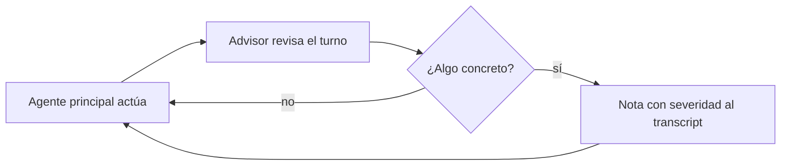

import { Aside } from '@astrojs/starlight/components';

# Advisor Agent

El advisor es un revisor que observa la sesión de otro agente. Un segundo modelo lee cada turno y, cuando detecta algo concreto, inyecta una nota que el agente principal lee en su turno siguiente. No es un objetivo de delegación: no lo invocás con `@advisor` ni le delegás tareas.

## Qué hace

1. **Observa cada turno** — Lee lo que el agente principal hizo y planea.
2. **Opina solo con señal** — Si no hay nada concreto, no interrumpe.
3. **Inyecta notas accionables** — Aparecen como toast y como bloque en el transcript, con severidad y la indicación explícita de ponderarlas, no de obedecerlas.



## Quick path

```bash
ywai advisor model   # Elegir el modelo del segundo revisor
ywai advisor off     # Apagarlo
```

El advisor queda apagado hasta que configurás **modelo + flag de activado**, porque cada turno revisado cuesta una llamada extra al modelo.

## Prioridades del proyecto

Las prioridades de revisión específicas del repo van en `WATCHDOG.md` en la raíz (o `.ywai/WATCHDOG.md`): cosas que vale marcarle a un revisor pero son demasiado ruidosas para el prompt del agente que ejecuta.

## Límites

| ✅ Puede | ❌ No puede |
|---|---|
| Revisar turnos y marcar riesgos | Ejecutar tareas o editar código |
| Sugerir con severidad | Bloquear al agente principal |
| Leer `WATCHDOG.md` | Recibir delegaciones (`task` denegado) |

<Aside type="caution">
Las notas del advisor son una segunda opinión, no órdenes. El agente principal las pondera contra su propio contexto.
</Aside>
