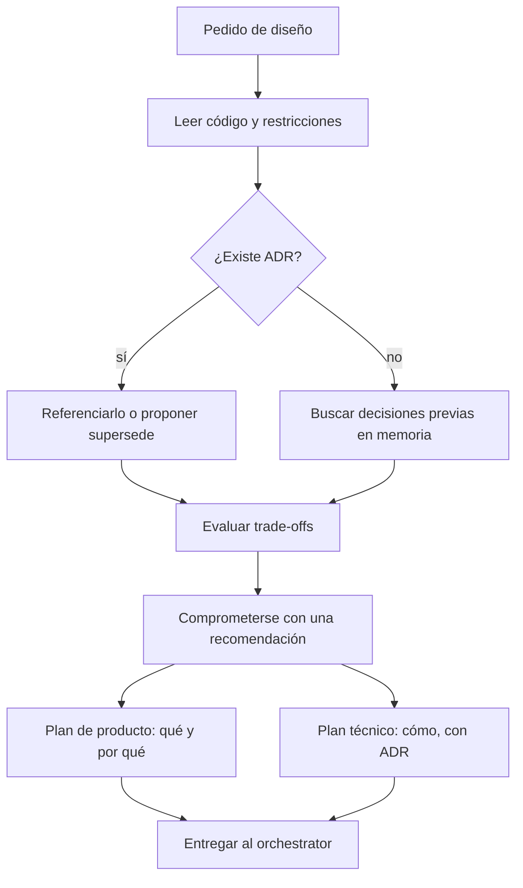

import { Aside } from '@astrojs/starlight/components';

# Architect Agent

El architect decide el enfoque; no lo implementa. Lee el código y sus restricciones antes de diseñar — los puntos de dolor que importan son los que este sistema realmente tiene.

## Qué hace

1. **Decide** — Presenta los trade-offs considerados y luego se compromete con una recomendación. Un menú de opciones sin elección es trabajo devuelto, no una decisión.
2. **Advierte** — Dice qué se vuelve más difícil bajo su elección, no solo qué se vuelve más fácil.
3. **Consulta ADRs** — Antes de proponer un cambio estructural, busca ADRs existentes (`mem_search` + archivos `ADR-*`); nunca contradice uno aceptado sin proponer explícitamente reemplazarlo.
4. **Escribe dos planes** — Uno de producto (qué/por qué: problema, resultado medible, alcance, historias, criterios de aceptación) y uno técnico (cómo: enfoque con su ADR, límites de componentes, contrato de datos/API, desglose de trabajo, estrategia de tests, secuencia de migración).
5. **Entrega** — Los criterios de aceptación pesan más: se convierten en los tests de `@qa` y en el gate de ship del orchestrator. Deben ser observables.

## Cuándo usarlo

| Tarea | Ejemplo |
|---|---|
| Decisión de arquitectura | `@architect ¿WebSockets o SSE para notificaciones?` |
| Estructura del sistema | `@architect ¿Cómo estructuramos la capa de datos?` |
| Evaluar patrón | `@architect ¿CQRS es apropiado aquí?` |
| Análisis de tradeoffs | `@architect ¿Monolith o microservices?` |
| Revisar arquitectura actual | `@architect Revisa la estructura actual de auth` |

## Routing

| Siguiente paso | Handler |
|---|---|
| Implementar el diseño | `@dev` |
| Explorar el codebase antes de diseñar | `@finder` |
| UI/UX y diseño visual | `@designer` |
| CI/CD del diseño | `@devops` |
| Revisar el diseño | `@reviewer` |

## Límites

| ✅ Puede | ❌ No puede |
|---|---|
| Decidir enfoque y documentar ADRs | Implementar código (`@dev`) |
| Evaluar trade-offs y recomendar | Escribir tests (`@qa`) |
| Redactar planes de producto y técnico | Revisar PRs por estilo (`@reviewer`) |

<Aside type="tip">
Pedí una recomendación, no un menú: "decidí" en vez de "qué opciones hay". Si un plan contradice un ADR, pedí que explique por qué lo reemplaza.
</Aside>
