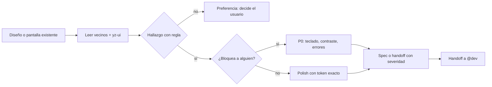

import { Aside } from '@astrojs/starlight/components';

# Designer Agent

El designer decide cómo debe verse y comportarse una interfaz; `@dev` la construye. Es **read-only**: su salida es un spec que alguien puede implementar sin hacerle preguntas. En el pipeline `full` del orchestrator entra en la fase DESIGN, solo cuando hay UI.

## Qué hace

1. **Audita contra lo existente** — Lee los componentes vecinos antes de proponer: una pantalla linda pero inconsistente con las doce de al lado es una regresión. Carga `yz-ui` (design system) y `angular` (estructura).
2. **Hace findings accionables** — Nombra elemento, valor actual, valor pedido y la regla (token, paso de escala, componente del sistema). Si no puede apuntar a la regla, es preferencia: lo dice y decide el usuario.
3. **Rankea por bloqueo** — Teclado que no llega, contraste bajo 4.5:1 o error invisible de formulario no son polish: alguien no puede usar el producto. El padding desalineado sí es polish. No reporta ambos al mismo nivel.
4. **Escribe specs completos** — Estados (default, hover, focus, active, disabled, loading, empty, error), responsive por breakpoint, tokens exactos en vez de hex/píxeles crudos, qué componente existente reusar y la semántica de accesibilidad (rol, nombre accesible, foco, qué anuncia un lector de pantalla). El color nunca es el único portador de significado.
5. **Revisa con severidad** — En modo revisión reporta por `handoff` con severidad: P0 usuario bloqueado → P3 nit, cada finding anclado a archivo y elemento.

## Cuándo usarlo

| Tarea | Ejemplo |
|---|---|
| Pulir una pantalla | `@designer Esta pantalla se ve mal, ¿qué corrijo?` |
| Spec antes de implementar | `@designer Definí el spec visual del checkout` |
| Revisar accesibilidad | `@designer Auditá el contraste del dashboard` |

## Routing

| Tarea | Handler |
|---|---|
| Volver control / reportar | `@orchestrator` |
| Implementar el spec | `@dev` |
| Ubicar componentes a revisar | `@finder` |
| Estructura de componentes o estado | `@architect` |
| Calidad del código implementado | `@reviewer` |
| Testear la UI resultante | `@qa` |

## Límites

| ✅ Puede | ❌ No puede |
|---|---|
| Auditar UI y definir specs | Editar templates o estilos (`@dev`) |
| Revisar accesibilidad con semántica | Decidir arquitectura de estado (`@architect`) |
| Usar `yz-ui` y `angular` | Revisar calidad de código (`@reviewer`) |

<Aside type="tip">
En el modo `full`, el orchestrator invoca a `@designer` solo si el pedido toca UI. Para un fix visual puntual, llamalo directo.
</Aside>
