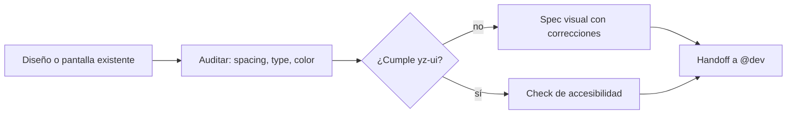

import { Aside } from '@astrojs/starlight/components';

# Designer Agent

El designer es el especialista en UX/UI. Audita interfaces, define especificaciones visuales y revisa pantallas contra el design system y los estándares de accesibilidad. En el pipeline `full` del orchestrator entra en la fase DESIGN, solo cuando hay UI.

## Qué hace

1. **Audita pantallas** — Detecta problemas visuales: espaciado, tipografía, color, jerarquía.
2. **Define specs** — Describe el estado visual esperado para que `@dev` lo implemente.
3. **Revisa contra el sistema** — Verifica cumplimiento con `yz-ui` y las guías de `angular`.
4. **Chequea accesibilidad** — Contraste, foco, navegación por teclado, semántica.

## Cuándo usarlo

| Tarea | Ejemplo |
|---|---|
| Pulir una pantalla | `@designer Esta pantalla se ve mal, ¿qué corrijo?` |
| Spec antes de implementar | `@designer Definí el spec visual del checkout` |
| Revisar accesibilidad | `@designer Auditá el contraste del dashboard` |

## Routing

| Tarea | Handler |
|---|---|
| Implementar el spec | `@dev` |
| Componentes y tokens | Skills `yz-ui`, `angular` |
| Coordinar entrega multi-fase | `@orchestrator` |

## Límites

| ✅ Puede | ❌ No puede |
|---|---|
| Auditar UI y definir specs | Implementar el código (`@dev`) |
| Revisar accesibilidad | Decisiones de arquitectura (`@architect`) |
| Usar `yz-ui` y `angular` | Escribir tests (`@qa`) |

<Aside type="tip">
En el modo `full`, el orchestrator invoca a `@designer` solo si el pedido toca UI. Para un fix visual puntual, llamalo directo.
</Aside>
