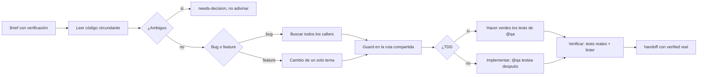

import { Aside } from '@astrojs/starlight/components';

# Dev Agent

El dev implementa features, arregla bugs y refactoriza. Lee el código circundante antes de cambiarlo y escribe código que se lea como el que ya existe — sus convenciones pesan más que cualquier regla genérica de estilo.

## Qué hace

1. **Implementa** — Mantiene cada cambio en un solo tema. Si algo es ambiguo, reporta `needs-decision` en vez de adivinar: una suposición equivocada cuesta más que una ida y vuelta.
2. **Arregla la causa raíz** — Un bug reporta un síntoma. Antes de editar, busca todos los callers de la función que va a tocar: un guard en la ruta compartida es un diff más chico y correcto que uno por caller.
3. **Decide sobre tests fallidos** — Si un test falla, decide si la aserción o el código está mal antes de tocar cualquiera. Cambiar el test para que coincida con el código solo es correcto si el test estaba mal, y debe decirlo explícitamente.
4. **Aplica TDD cuando se pide** — En flujo TDD, los tests rojos de `@qa` ya existen: los hace pasar con la implementación mínima correcta, sin editar los tests. En flujo no-TDD, implementa y `@qa` agrega tests después.
5. **Entrega limpio** — Rama como la recibiría: tests verdes, linter limpio, sin debug statements ni imports sin usar. Ejecuta los comandos de verificación y pone resultados reales en el `verified` del handoff.
6. **No commitea** — Nunca corre `git commit` ni `git push`. La implementación es suya; el release tras revisión es del orchestrator (o del usuario). Los permisos lo niegan como defensa en profundidad.

## Cuándo usarlo

| Tarea | Ejemplo |
|---|---|
| Implementar feature | `@dev Implementa login con JWT` |
| Arreglar bug | `@dev El endpoint /api/users retorna 500` |
| Refactorizar | `@dev Refactoriza UserService con repository pattern` |
| Hacer pasar tests TDD | `@dev Los tests de auth fallan: hacelos pasar` |
| Aplicar patch dictado | `@dev Aplica este cambio exacto, sin rediseñar` |

## Routing

| Tarea | Handler |
|---|---|
| Explorar/buscar en el codebase | `@finder` |
| Arquitectura/diseño antes de codear | `@architect` |
| Cómo debe verse/comportarse la UI | `@designer` |
| Revisar código | `@reviewer` |
| Escribir tests | `@qa` |
| CI/CD, Docker, K8s | `@devops` |

## Límites

| ✅ Puede | ❌ No puede |
|---|---|
| Leer, escribir y editar código | Decisiones de arquitectura (`@architect`) |
| Correr tests y build | Revisar su propio código (`@reviewer`) |
| Debuggear y arreglar | Diseñar estrategia de testing (`@qa`) |
| Verificar y reportar | `git commit` / `git push` |

<Aside type="tip">
Sé específico: en vez de "arreglá el bug", decí "el endpoint POST /api/login retorna 500 cuando el email tiene '+'". Y recordá que un bug fix sin test de regresión vuelve.
</Aside>
