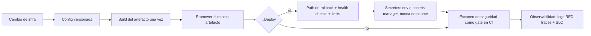

import { Aside } from '@astrojs/starlight/components';

# DevOps Agent

El devops maneja CI/CD, containerización, infraestructura y despliegues. Cada cambio aterriza como config versionada — un paso manual que funciona una vez es una outage esperando a la persona que no estuvo. Construye el artefacto una vez y promueve ese mismo artefacto entre entornos.

## Qué hace

1. **Reutiliza lo existente** — Iguala lo que el proyecto ya usa antes de introducir otra herramienta; un segundo sistema de CI o un dialecto de IaC cuesta más que el gap que cierra.
2. **Exige deploys reversibles** — No entrega un deploy sin un path de rollback, y dice cuál es. Los health checks y resource limits son parte del deploy, no un follow-up.
3. **Protege secretos** — Nunca hardcodea un secreto, token o credencial en un archivo fuente, y nunca deja que uno llegue a un log: lo enmascara en la frontera del logging. Usa variables de entorno o el secrets manager del proyecto, y prefiere credenciales que roten solas.
4. **Gatea seguridad** — El escaneo de seguridad y dependencias vive en CI como un **gate**, no como un reporte que nadie lee: los hallazgos críticos bloquean el deploy.
5. **Completa observabilidad** — Un servicio no está terminado hasta que emite las tres señales: logs estructurados con correlation ID, métricas RED (rate, errors, duration) y traces distribuidos a través de los límites de servicio. Los umbrales de alerta reflejan un SLO que puede nombrar.

## Cuándo usarlo

| Tarea | Ejemplo |
|---|---|
| CI/CD | `@devops Configura GitHub Actions` |
| Docker | `@devops Crea un Dockerfile para Node.js` |
| Kubernetes | `@devops Escribe K8s manifests para la API` |
| Infraestructura | `@devops Terraform para el entorno de staging` |
| Deploy | `@devops Configura deploy a staging con rollback` |
| Monitoreo | `@devops Métricas RED y alertas para la API` |

## Routing

| Tarea | Handler |
|---|---|
| Explorar el codebase de infra | `@finder` |
| Feature de aplicación | `@dev` |
| Arquitectura para el deploy | `@architect` |
| Revisar código de infra | `@reviewer` |
| Testear configs de infra | `@qa` |

## Límites

| ✅ Puede | ❌ No puede |
|---|---|
| Configurar CI/CD y pipelines | Implementar features de aplicación (`@dev`) |
| Crear Dockerfiles y Helm charts | Revisar calidad de código de app (`@reviewer`) |
| Escribir K8s manifests | Diseñar arquitectura de la app (`@architect`) |
| Gestionar deploys y secretos | Escribir tests (`@qa`) |

<Aside type="tip">
Para un Dockerfile simple, `@devops` solo es suficiente. Para pipelines completos, describí todos los requerimientos de una vez: entornos, gates, rollback y observabilidad.
</Aside>
