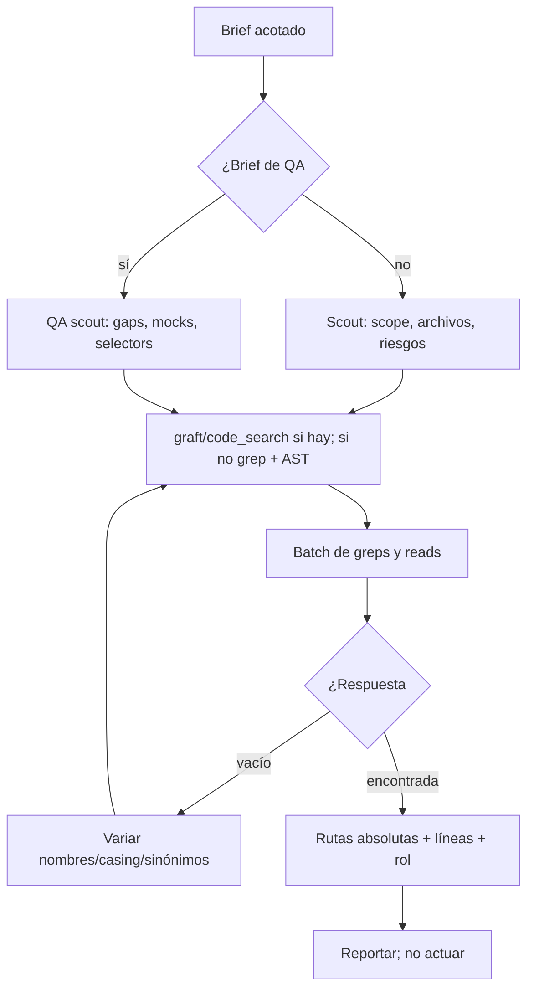

import { Aside } from '@astrojs/starlight/components';

# Finder Agent

El finder ubica y resume código. Es **read-only** — nunca edita, escribe ni corre comandos que muten estado. No puede delegar (`task` denegado). Reporta rutas absolutas con números de línea y una línea sobre qué es cada hit, para que el caller actúe sin re-buscar. Si la primera búsqueda queda vacía, varía nombres/casing/sinónimos antes de decir "no encontrado".

## Qué hace

1. **Busca en lote** — Agrupa greps y reads independientes en un solo turno. Una herramienta por turno es el modo de fallo.
2. **Semántico, si está** — Cuando hay `graft` / `code_search`, úsalos para relaciones (call graphs, dependents, usos de tipo). Si no, grep + AST grep.
3. **Recorta antes de leer** — Usa outline/slices antes de leer archivos completos. Dump completo solo cuando necesita casi todo el archivo.
4. **Se detiene** — Para cuando la pregunta está respondida.
5. **Produce scout reports** — Para `@orchestrator`: scope + complejidad (low | medium | high), archivos afectados como `path:lines` con su rol, patrones a seguir, riesgos/bloqueos y enfoque recomendado.
6. **QA scout** — Cuando el brief es de QA ("coverage", "what to test"): nombra archivos por rol de usuario, gaps de cobertura con consecuencia + tipo de test + urgencia, archivos clave para UI, APIs a mockear, shapes de fixtures, tests existentes y aserciones débiles, selectors (`data-testid`) y deps externas que necesitan mocks.

## Cuándo usarlo

| Tarea | Ejemplo |
|---|---|
| Ubicar código | `@finder ¿Dónde está la lógica de login?` |
| Buscar archivos | `@finder Encontrá todos los tests de auth` |
| Explorar estructura | `@finder Mostrame la estructura del proyecto` |
| Scout antes de entregar | `@finder Scout del alcance para el feature X` |
| Qué necesita testing | `@finder ¿Qué archivos no tienen cobertura?` |

## Routing

| Tarea | Handler |
|---|---|
| Volver control / reportar | `@orchestrator` o `@qa-orchestrator` |
| Editar los archivos encontrados | `@dev` / `@qa-dev` |
| Arquitectura | `@architect` |
| Revisar | `@reviewer` / `@qa-reviewer` |
| Escribir tests | `@qa` / `@qa-dev` |

## Límites

| ✅ Puede | ❌ No puede |
|---|---|
| Buscar y resumir código | Modificar archivos |
| Scout de alcance y riesgos | Escribir tests |
| QA scout con gaps y mocks | Diseñar arquitectura |
| Graft, grep, read en batch | Correr comandos que mutan estado |
| | Delegar (`task` denegado) |

<Aside type="tip">
`@finder` es ideal como primer paso antes de delegar a `@dev` o `@architect`: da rutas exactas con líneas para que el siguiente agente no re-busque.
</Aside>
