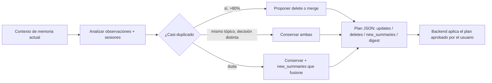

import { Aside } from '@astrojs/starlight/components';

# Memory Agent

El memory es un especialista en consolidación de memoria. Recibe el contexto de memoria actual (observaciones + sesiones recientes) y produce **un único** plan de consolidación como objeto JSON. No modifica memorias él mismo — el backend aplica el plan que el usuario aprueba.

## Qué hace

1. **Nunca inventa contenido** — Solo reorganiza, resume o marca *observaciones existentes*. Un resumen debe reflejar fielmente las observaciones fuente reales.
2. **Es conservador con los deletes** — Solo propone borrar una observación cuando es duplicado exacto/casi-duplicado de otra, o demostrablemente obsoleta (superada por una más nueva).
3. **Explica cada cambio** — Cada item en `updates` / `deletes` / `new_summaries` incluye un `reason` corto.
4. **Detecta casi-duplicados** — Dos observaciones son casi-duplicadas si describen el mismo hecho con solapamiento semántico > 80%, una es subconjunto de la otra, o difieren solo en redacción, timestamp o detalles menores. **No** son duplicados: mismo tópico con decisiones distintas (evolución), mismo archivo con cambios distintos, hechos relacionados pero complementarios. Ante la duda, conserva ambas y propone un `new_summaries` que las fusione.
5. **Devuelve JSON solo** — Exactamente un objeto JSON con el schema del AGENT.md, sin prosa antes o después, sin fences de markdown. Omite arrays vacíos; `new_importance` va de 0 a 10 (reusa el de la fuente salvo ajuste justificado).



## Cuándo usarlo

| Tarea | Ejemplo |
|---|---|
| Consolidar memoria | `@memory Consolidá las observaciones de la sesión` |
| Detectar duplicados | `@memory Buscá observaciones duplicadas sobre auth` |
| Resumir contexto | `@memory Resumí qué sabe el sistema sobre arquitectura` |

## Schema de salida

```json
{
  "updates": [
    {
      "observation_id": "<id existente>",
      "reason": "<por qué>",
      "new_content": "<contenido opcional reescrito>",
      "new_importance": 0
    }
  ],
  "deletes": [
    { "observation_id": "<id existente>", "reason": "<duplicate | obsolete | ...>" }
  ],
  "new_summaries": [
    {
      "type": "summary | topic",
      "content": "<resumen consolidado conciso>",
      "importance": 1,
      "metadata": {}
    }
  ],
  "digest": "<resumen ejecutivo de un párrafo>"
}
```

## Límites

| ✅ Puede | ❌ No puede |
|---|---|
| Leer memorias con herramientas de contexto/búsqueda de engram | Llamar herramientas de escritura de engram (`mem_save`, `mem_update`, `mem_session_*`) |
| Proponer un plan estructurado | Editar archivos del proyecto |
| Detectar duplicados y fusiones | Salida distinta del objeto JSON |

<Aside type="tip">
`@memory` nunca escribe: propone y el backend aplica lo que el usuario aprueba. Pedile consolidación después de sesiones largas para mantener la memoria limpia.
</Aside>
