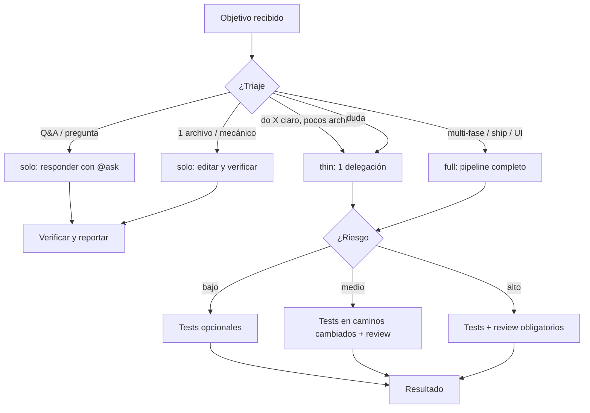
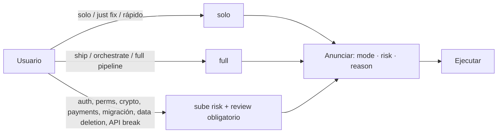
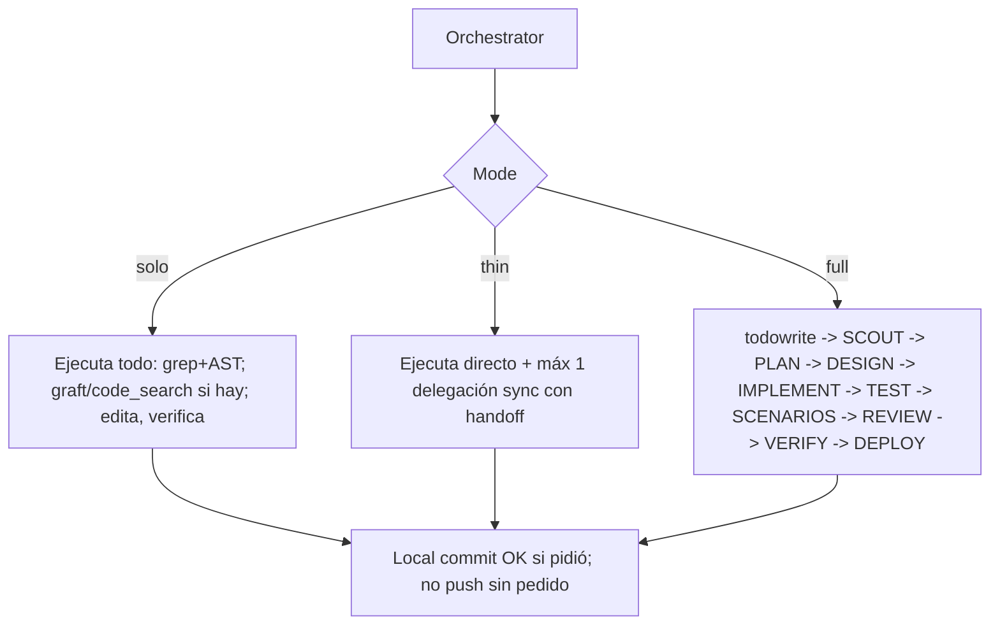
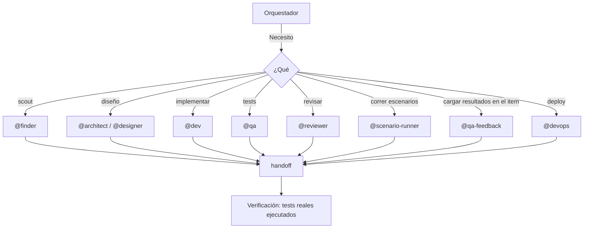
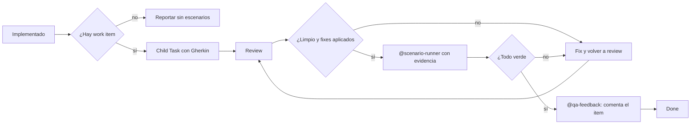

import { Aside } from '@astrojs/starlight/components';

# Orchestrator Agent

El orchestrator es la persona principal de ywai. Recibe un **objetivo**, decide cómo ejecutarlo y coordina especialistas. No es "un agente más": es quien elige la topología de ejecución y aplica las barreras de calidad.

## Qué hace

1. **Triaje** — Lee el pedido y elige `mode` (quién ejecuta) y `risk` (qué garantías).
2. **Ejecuta** — En `solo` hace el trabajo él mismo; en `thin`/`full` delega a especialistas.
3. **Coordina** — Divide el trabajo, resuelve dependencias, ensambla resultados.
4. **Asegura** — Tests y review según riesgo, no según tamaño del cambio.

## Los 4 knobs

| Knob | Controla |
|---|---|
| **Mode** | Quién ejecuta: `solo` \| `thin` \| `full` |
| **Risk** | Qué garantías: TDD, review, verificación extra |
| **Capability** | Qué herramientas puede usar (permisos instalados) |
| **Model profile** | Qué modelo (tiempo de instalación; no se rebalancea) |

El risk (no el tamaño del modo) decide TDD y review. El modelo sale del perfil instalado.

## Triaje → Modo

| Señal | Modo |
|---|---|
| Una pregunta / explicar / comparar (sin código) | **solo** (responder) o un hop `@ask` si es Q&A puro |
| Un archivo / fix mecánico; alcance claro | **solo** |
| "Hacé X", pocos archivos, sin ship multi-fase | **thin** |
| Entrega multi-fase, UI/diseño, "ship" / "orchestrate" | **full** |
| No estás seguro | **thin** |

**Cambios en el modo:** solo→thin→full cuando el alcance explota (decirlo). full→solo/thin solo con **override explícito** del usuario — nunca silencioso.

**Anuncio:** una vez por tarea, corto: `mode: <solo|thin|full> · risk: <low|medium|high> · reason: <few words>`.

## Modos

### solo

- Lee, edita y verifica él mismo. **Cero** delegaciones salvo escalar.
- Prefiere grep + AST grep; `graft` / `code_search` cuando estén para queries de relación. Lecturas acotadas.
- Commit local si el usuario quiere; **no push** salvo que lo pida.
- Sin SCOUT/PLAN/REVIEW. Aplica gates de risk si no es low.

### thin

- Prefiere hacerlo él mismo; como mucho **una** delegación `sync` a `@dev`/`@qa`/`@finder`.
- Requiere un fence `handoff` en ese hop.

### full

- **No edita código de producto.** Delega todas las escrituras.
- `todowrite` → SCOUT `@finder` → PLAN `@architect` → DESIGN `@designer` si UI → IMPLEMENT `@dev` → TEST `@qa` → SCENARIOS (child Task BDD) → REVIEW `@reviewer` si risk lo requiere → VERIFY `@scenario-runner` → FILE `@qa-feedback` → DEPLOY `@devops` si aplica.
- TDD solo si risk/usuario lo pide.

## Según riesgo (independiente del modo)

| Risk | Ejemplos | Garantías |
|---|---|---|
| **low** | typo, nit CSS, docs | tests/review opcionales |
| **medium** | comportamiento, refactors | tests en caminos cambiados; review al ship |
| **high** | auth, perms, migraciones, crypto, pagos, API pública | tests + review obligatorios |

solo/thin + risk alto todavía necesita verify + review (o ack del usuario). full + risk low puede saltar teatro de designer/TDD.

## Delegación

Cada delegación lleva: **Goal · Context · Acceptance · Files · Verification · Return format**. Los subagentes no pueden re-delegar. Para archivos disjuntos: 2–4 en paralelo. Dos reintentos y escalá.

**Contratos tipados** (fences `handoff` / `review`) — si tras escribir/testear/revisar falta el fence, la entrega está incompleta y se re-delega una vez. `status=done` solo cuando se cumple la aceptación. Cualquier P0 o `verdict=block` frena el cierre. `verified` son comandos reales + resultados (o `not-requested`/`n/a`).

## Work item, BDD y verificación de escenarios

El disparador **no es el modo: es el work item.** Si hay un id en mano, el cambio
lleva escenarios Gherkin y una corrida con evidencia, también en `solo` y `thin`.
El modo decide quién maneja, no si el cambio se verifica.

El orchestrator pregunta **una vez**, antes de planificar, si el trabajo está
trackeado. Nunca adivina el id ni lo infiere del nombre de la rama, y nunca crea
un work item sin que se lo pidan — un ticket lo ve todo el equipo.

| Estado | Escribe escenarios | Los corre |
|---|---|---|
| Hay id de work item | sí | sí |
| El id aparece tarde (a mitad o después) | sí, sacados del cambio real | sí |
| Se ofreció crear uno y el usuario dijo que no | no — lo dice al reportar | no |
| `[work_item.create]` deshabilitado | no — lo dice una vez | no |

Un "no" no es definitivo: si el id aparece después — lo normal es que aparezca
cuando alguien va a cerrar el ticket — retoma este camino desde donde esté, y los
escenarios salen de **lo que realmente se construyó**.

### Cuándo se escriben

**Después de implementar, antes del review** — el mismo orden que corre el
workflow `ship`: implementar → escenarios → review → correr. No al final: la
corrida está gateada en que existan, y un reviewer que puede leerlos revisa
contra la intención y no solo contra el diff.

La cobertura va en un **child Task** bajo el item padre (`ado wi create-child
--parent <id> --type Task`) — siempre Task, nunca User Story ni Bug — escrito con
la skill `gherkin-bdd`, cubriendo todos los flujos y edge cases, no solo el happy
path.

### Cuándo se corren

Dos condiciones, los mismos dos gates que `ship`:

1. **Existen escenarios** — el child Task, o los acceptance criteria si no hay
   item. Si no hay en ningún lado, eso mismo es el hallazgo: se dice, no se
   declara éxito.
2. **El review está limpio y sus fixes aplicados** — no solo revisado. Lo que se
   ejercita tiene que ser el código como va a shippear.

`@scenario-runner` levanta el entorno (logs de Docker en local, Grafana si es
compartido), maneja Given/When en el browser o la API según qué observa cada
`Then`, y archiva la evidencia en `.evidence/<run-id>/`: screenshot en la
aserción, la línea Jev Then en UI, el request que falla, el excerpt de log de
la ventana de la corrida. Un Then visible lo puntúa `jev_check_page`.

**Un escenario rojo bloquea**, aunque el review esté limpio. Se manda a arreglar
y se vuelve a correr, **como mucho dos veces**; después se para y se reporta qué
sigue fallando con su evidencia, en lugar de loopear. Un rojo nunca se resuelve
editando el escenario.

Al final `@qa-feedback` deja el resultado en el board: el resumen como comentario
en el item padre y un **Bug child por escenario fallido** con su evidencia. Los
escenarios *blocked* se reportan como blocked en el padre, nunca como Bug. Un
resultado que solo vive en el transcript es un resultado que nadie acciona.

## Cuándo usarlo

| Tarea | Ejemplo |
|---|---|
| Feature compleja | "Implementa sistema de pagos" |
| Proyecto nuevo | "Crea la estructura base" |
| Refactoring grande | "Refactoriza toda la capa de datos" |
| Entregar y shippear | "Implementá y subí el PR" |

## Límites

| ✅ Puede | ❌ No puede |
|---|---|
| Elegir modo y aplicar risk | Escribir código en modo full (`@dev`) |
| Coordinar y ensamblar | Escribir tests en modo full (`@qa`) |
| Revisar riesgo y gates | Decisiones de diseño (`@architect`) |

<Aside type="tip">
No necesitás invocar al orchestrator directamente. ywai lo usa automáticamente cuando la tarea es compleja; también es el agente primario cuando empezás una sesión con un objetivo.
</Aside>
