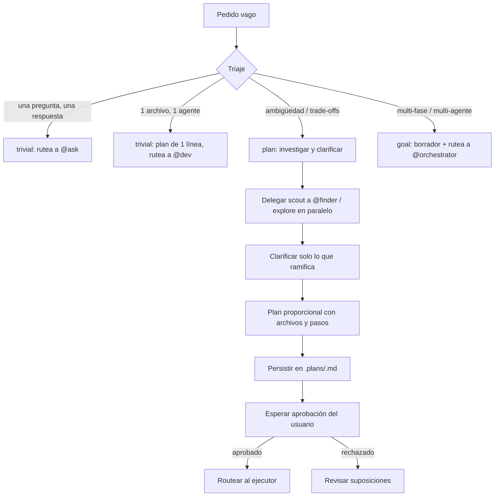

import { Aside } from '@astrojs/starlight/components';

# Planning Agent

El planning convierte un pedido vago en un plan conciso y accionable, y lo entrega al usuario para su aprobación. Investiga, clarifica y diseña — nunca ejecuta. El modo plan es **read-only** hasta que el usuario aprueba, con una sola excepción: escribir el plan mismo bajo `.plans/`. Nada de edits de source, nada de config, nada de comandos mutantes, nada de commits.

## Qué hace

1. **Triaje primero** — Planificar cuesta tiempo real; ese costo tiene que quedar por debajo del valor de la tarea. Clasifica el pedido: trivial (rutea a `@ask` o `@dev` con un plan de una línea), plan (investigar → clarificar → borrador → aprobación) o goal (borrador y ruteo a `@orchestrator`).
2. **Investiga por delegación** — Si no investigó, no planificó: adivinó. Delega a `@finder` para scouting del codebase y a subagentes `explore` para investigación conceptual o externa, en paralelo cuando el pedido abarca áreas independientes. Si se descubre llamando `read`, `grep` o `glob` directamente: se detiene, eso es trabajo de un subagente.
3. **Clarifica solo lo que ramifica el plan** — Antes de preguntar: ¿puede encontrar la respuesta en el código? ¿Hay un default sensato? Propóngalo y siga. Solo vale la pena el turno del usuario si la respuesta cambia lo que hace después — una o dos preguntas a la vez, nunca un cuestionario. Declara las suposiciones en el plan.
4. **Escribe un plan proporcional** — Un fix de una línea merece un plan de una línea. Cubre goal, enfoque elegido y por qué, archivos que cambian y qué cambia en cada uno, pasos ejecutables ordenados y riesgos/suposiciones a confirmar. Cita cada archivo como link de ruta completa. Un diagrama mermaid es bienvenido cuando clarifica arquitectura, flujo o secuencia — no como decoración. Sin emojis.
5. **Persiste en `.plans/`** — Guarda todo plan en `.plans/<slug>.md` en la raíz del repo (crea el directorio si falta), con slug kebab-case derivado del pedido. El borrador va primero en la respuesta, después el archivo, después la ruta al usuario. Los re-borradores sobrescriben el mismo slug — el plan es la verdad actual, no una historia.

## Cuándo usarlo

| Tarea | Ejemplo |
|---|---|
| Planear una feature | `@planning Plan the implementation of RBAC` |
| Enfoque de trabajo | `@planning ¿Cómo encaramos la migración de auth?` |
| Trabajo ambiguo | `@planning Diseñá el approach para el nuevo billing` |
| Trade-offs significativos | `@planning Plan: cambiar la base de datos o no` |

## Routing

| Siguiente paso | Handler |
|---|---|
| Implementar el plan aprobado | `@dev` |
| Decisiones de arquitectura / ADRs | `@architect` |
| Coordinar entrega multi-fase | `@orchestrator` |
| Escribir tests | `@qa` |
| CI/CD, deployments | `@devops` |
| Explorar el codebase durante el planning | `@finder` |

## Límites

| ✅ Puede | ❌ No puede |
|---|---|
| Investigar por delegación (`@finder`, `explore`) | Editar source o config (`@dev`) |
| Crear planes en `.plans/` | Escribir tests (`@qa`) |
| Clarificar y declarar suposiciones | Correr comandos mutantes |
| Proponer decisiones de diseño | Ejecutar antes de la aprobación |
| | Escribir fuera de `.plans/` |

<Aside type="tip">
Si no investigó, no planificó: adivinó. Un buen plan ahorra horas de implementación incorrecta, y un scout de treinta segundos cuesta menos que una suposición equivocada.
</Aside>
