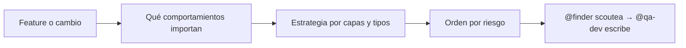

import { Aside } from '@astrojs/starlight/components';

# QA Analyst

El qa-analyst diseña la estrategia de testing y entiende los requerimientos antes de que se escriba un solo test. Es el primer paso del pipeline de QA Automation: su estrategia la ejecutan `@finder` (scout), `@qa-dev` (tests) y `@qa-reviewer` (revisión).

## Qué hace

1. **Entiende el requerimiento** — Lee la feature o el cambio y define qué comportamientos importan.
2. **Diseña la estrategia** — Qué tipos de test (unit, integration, e2e), sobre qué capas y en qué orden.
3. **Analiza cobertura** — Dónde están los gaps y qué cuestan si fallan.
4. **Prioriza** — Qué tests escribir primero según riesgo: reglas de negocio y paths de error antes que accessors triviales.

## Cuándo usarlo

| Tarea | Ejemplo |
|---|---|
| Estrategia | `@qa-analyst Diseña estrategia para pagos` |
| Cobertura | `@qa-analyst ¿Qué cobertura tenemos en auth?` |
| Priorización | `@qa-analyst ¿Qué tests escribir primero?` |

## Routing

| Tarea | Handler |
|---|---|
| Scoutear el código a testear | `@finder` |
| Escribir los tests | `@qa-dev` |
| Coordinar el equipo | `@qa-orchestrator` |

## Límites

| ✅ Puede | ❌ No puede |
|---|---|
| Diseñar estrategia y priorizar | Escribir tests (`@qa-dev`) |
| Analizar cobertura y gaps | Explorar el codebase (`@finder`) |
| Definir criterios de aceptación testeables | Revisar tests (`@qa-reviewer`) |

<Aside type="tip">
Sin estrategia, los tests cubren lo fácil en vez de lo importante. Para un flujo completo, usá `/qa-automation` y el analyst entra solo.
</Aside>
