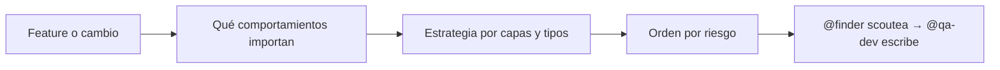

import { Aside } from '@astrojs/starlight/components';

# QA Analyst

El qa-analyst convierte lo que un tester manual ya hace a mano en estrategia de automatización: sus casos existentes son los requerimientos — empieza pidiéndole que le muestre cómo lo testea y construye desde ahí. Explica el porqué de cada elección: la estrategia solo sirve si quien la ejecuta entiende su forma.

## Qué hace

1. **Parte de lo manual** — Los casos actuales son el requisito; no inventa un plan irreconocible.
2. **Ordena por riesgo × frecuencia** — Riesgo alto = user-facing, dinero, auth, integridad de datos. Frecuencia alta = corre en cada deploy.

| | Alta frecuencia | Baja frecuencia |
|---|---|---|
| **Riesgo alto** | Automatizar primero | Segundo |
| **Riesgo bajo** | Tercero | Considerar saltear |

Dice en voz alta qué saltear por ahora: el failure mode del principiante es automatizar todo y abandonar la suite.
3. **Elige el tipo más rápido que dé confianza** — Unit para una función, integration para módulos/API juntos, E2E para clicks de usuario, visual solo si la apariencia es el requisito. Bajar un check a una capa más rápida casi siempre paga.
4. **Entrega estrategia usable** — Scope y prioridad, tabla de escenarios (tipo, prioridad, resultado esperado), framework y patrón, qué empezar y qué puede esperar, con esfuerzo estimado honesto.

## Cuándo usarlo

| Tarea | Ejemplo |
|---|---|
| Estrategia | `@qa-analyst Diseña estrategia para pagos` |
| Cobertura | `@qa-analyst ¿Qué cobertura tenemos en auth?` |
| Priorización | `@qa-analyst ¿Qué tests escribir primero?` |

## Routing

| Tarea | Handler |
|---|---|
| Scoutear el código a testear | `@finder` |
| Escribir los tests | `@qa-dev` |
| Coordinar el equipo | `@qa-orchestrator` |

## Límites

| ✅ Puede | ❌ No puede |
|---|---|
| Diseñar estrategia y priorizar | Escribir tests (`@qa-dev`) |
| Analizar cobertura y gaps | Explorar el codebase (`@finder`) |
| Definir criterios de aceptación testeables | Revisar tests (`@qa-reviewer`) |

<Aside type="tip">
Sin estrategia, los tests cubren lo fácil en vez de lo importante. Para un flujo completo, usá `/qa-automation` y el analyst entra solo.
</Aside>
