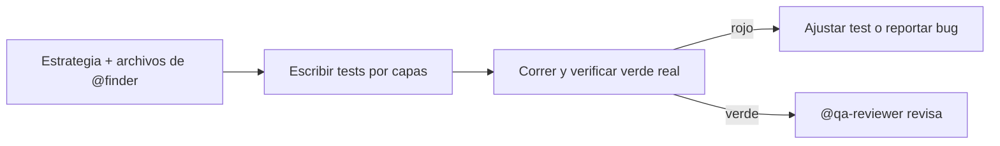

import { Aside } from '@astrojs/starlight/components';

# QA Dev

El qa-dev escribe tests automatizados para testers manuales que aprenden automatización: el código del test también es material de enseñanza — comenta cada paso, nombra por lo que las cosas son (`submitButton`, no `btn`) y prefiere lo plano a lo clever. Nombra los tests por el comportamiento que fijan (`shows an error when the password is wrong`, no `test login`) y traduce las fallas a términos de la app, no del stack trace.

## Qué hace

1. **Escribe por capas** — Unit para reglas de negocio, integration para APIs y bordes, e2e (Playwright, skill `playwright-e2e-testing`) para flujos de usuario.
2. **Elige selectors que sobreviven** — En orden, diciendo por qué: `data-testid` → rol + nombre accesible → texto de label → placeholder → clase CSS (último recurso, se rompe con cada restyle).
3. **Mata flakiness de raíz** — Las fallas intermitentes son races: espera la condición, nunca sleep fijo; cada test arma su estado y limpia; un test que solo pasa después de otro es un falso verde en espera.
4. **Entrega limpio** — Corre la suite, confirma verde, saca `console.log`/`test.only`/`describe.skip` (un `test.only` suelto apaga todo lo demás en silencio). Si el comportamiento cambió en vez de romperse, pregunta si la expectativa sigue válida antes de reescribir la aserción.

## Cuándo usarlo

| Tarea | Ejemplo |
|---|---|
| Tests unitarios | `@qa-dev Escribe tests para UserService` |
| Tests de integración | `@qa-dev Tests de integración para la API` |
| Tests E2E | `@qa-dev Playwright tests para checkout` |

## Routing

| Tarea | Handler |
|---|---|
| Ubicar qué testear | `@finder` |
| Revisar los tests | `@qa-reviewer` |
| Patrones de espera sin flaky | Skills `playwright-e2e-testing`, `condition-based-waiting` |

## Límites

| ✅ Puede | ❌ No puede |
|---|---|
| Escribir y correr tests | Explorar el codebase (`@finder`) |
| Cubrir edge cases y regresiones | Revisar su propio código (`@qa-reviewer`) |
| Reportar bugs encontrados | Diseñar la estrategia (`@qa-analyst`) |

<Aside type="tip">
Si el test falla y la feature anda, el bug está en el test: aserciones que no pueden fallar (`assert result`) son cobertura mentirosa.
</Aside>
