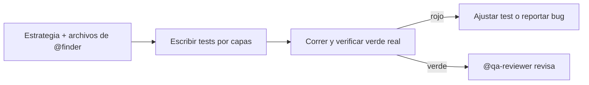

import { Aside } from '@astrojs/starlight/components';

# QA Dev

El qa-dev escribe tests automatizados — unit, integration y e2e — sobre los archivos que `@finder` ya ubicó y según la estrategia de `@qa-analyst`. Sus tests los revisa `@qa-reviewer`.

## Qué hace

1. **Escribe por capas** — Unit para reglas de negocio, integration para APIs y bordes, e2e (Playwright) para flujos de usuario.
2. **Cubre edge cases** — Límites, paths de error y transiciones, no solo el camino feliz.
3. **Verifica en verde real** — Corre los tests y reporta resultados; un test que pasa con la feature rota es un bug del test.
4. **Regression-first en bugfix** — Cada fix viaja con su test de regresión escrito antes del fix.

## Cuándo usarlo

| Tarea | Ejemplo |
|---|---|
| Tests unitarios | `@qa-dev Escribe tests para UserService` |
| Tests de integración | `@qa-dev Tests de integración para la API` |
| Tests E2E | `@qa-dev Playwright tests para checkout` |

## Routing

| Tarea | Handler |
|---|---|
| Ubicar qué testear | `@finder` |
| Revisar los tests | `@qa-reviewer` |
| Patrones de espera sin flaky | Skills `playwright-e2e-testing`, `condition-based-waiting` |

## Límites

| ✅ Puede | ❌ No puede |
|---|---|
| Escribir y correr tests | Explorar el codebase (`@finder`) |
| Cubrir edge cases y regresiones | Revisar su propio código (`@qa-reviewer`) |
| Reportar bugs encontrados | Diseñar la estrategia (`@qa-analyst`) |

<Aside type="tip">
Si el test falla y la feature anda, el bug está en el test: aserciones que no pueden fallar (`assert result`) son cobertura mentirosa.
</Aside>
