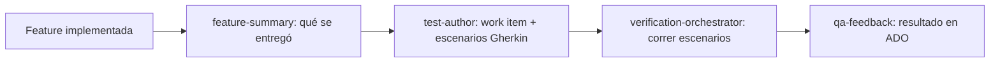

import { Aside } from '@astrojs/starlight/components';

# QA Exploratory

El ciclo exploratorio cubre lo que pasa **después** de implementar: resumir qué se entregó, crear el work item de testing exploratorio con sus escenarios en Gherkin, verificarlos contra la app y archivar el resultado en Azure DevOps. Son 5 agentes que trabajan en cadena, coordinados por dos orchestrators.

## El equipo

| Agente | Rol | Para qué |
|---|---|---|
| **exploratory-orchestrator** | Coordinador | Coordina el ciclo: resume lo entregado, después crea el work item y sus escenarios |
| **feature-summary** | Analista | Resume la feature y sus casos de uso para QA, desde el código y su diff |
| **test-author** | QA | Crea el work item de testing exploratorio en ADO y escribe sus escenarios en Gherkin |
| **verification-orchestrator** | Coordinador | Coordina la verificación: corre los escenarios y archiva el resultado |
| **qa-feedback** | QA | Registra la corrida en el work item: comentario resumen y un Bug hijo por escenario fallido |

## Flujo



1. `exploratory-orchestrator` resume con `feature-summary` qué se entregó.
2. `test-author` crea el work item exploratorio y escribe los escenarios (`gherkin-bdd`).
3. `verification-orchestrator` corre los escenarios contra la app (`scenario-runner` a nivel core hace lo mismo en el pipeline ship).
4. `qa-feedback` archiva: comentario resumen en el padre + un Bug hijo por escenario que falle, cada uno con su evidencia (`qa-evidence`).

## Instalación

Estos agentes **no** tienen grupo propio en `groups.json`: el install por defecto (`core + qa-automation`) no los copia. Llegan con:

```bash
ywai install --all-groups
```

El workflow semilla `/qa-exploratory` (ya viene con ywai, ver [Commands](/dev-ai-workflow/workflows/commands)) ejecuta este ciclo end-to-end sin instalar los agentes a mano.

## Cuándo usarlo

| Necesidad | Cómo |
|---|---|
| Testing exploratorio completo | `/qa-exploratory` |
| Resumir una feature para QA | `exploratory-orchestrator` vía el workflow |
| Verificar escenarios post-review | `/scenario-verification` |

<Aside type="tip">
Para testing automatizado con estrategia, el grupo es [QA Automation](/dev-ai-workflow/agents/qa-orchestrator). Lo exploratorio es post-implementación y termina en ADO.
</Aside>
