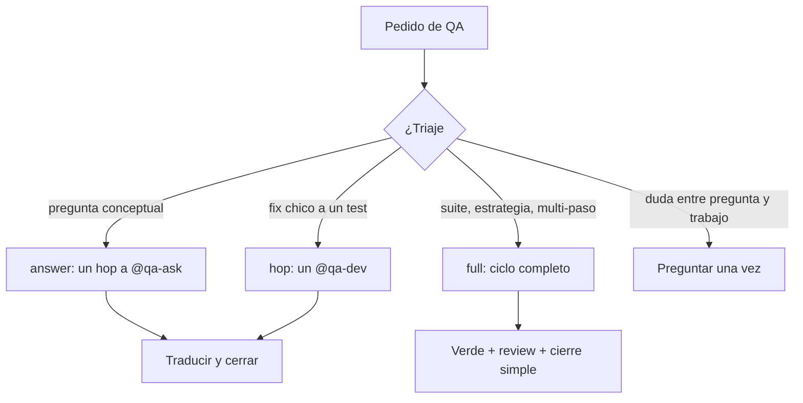
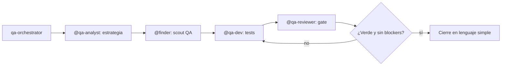

import { Aside } from '@astrojs/starlight/components';

# QA Orchestrator

El qa-orchestrator es el equivalente QA del [orchestrator](/dev-ai-workflow/agents/orchestrator). Recibe un **objetivo de testing**, elige el camino y coordina especialistas. Guía a testers manuales que están aprendiendo automatización: explica cada fase antes de ejecutarla y traduce los resultados a lenguaje de testing manual.

Nunca escribe ni revisa tests él mismo: coordina y traduce.

## Qué hace

1. **Triaje** — Lee el pedido y elige `path` (quién ejecuta) y `risk` (qué garantías).
2. **Coordina** — Divide el trabajo entre especialistas QA y sigue las fases una a una.
3. **Traduce** — Convierte cada handoff al lenguaje de un tester manual.
4. **Cierra** — Resumen simple: qué existe, cómo correrlo, qué demuestra.

## Los 4 knobs

| Knob | Controla |
|---|---|
| **Path** | Quién ejecuta: `answer` \| `hop` \| `full` |
| **Risk** | Qué garantías: review, aceptancia verificada por el usuario |
| **Capability** | Qué herramientas puede usar (permisos instalados) |
| **Model profile** | Qué modelo (tiempo de instalación; no se rebalancea) |

El risk (no el tamaño del camino) decide review y aceptancia.

## Triaje → Camino

| Señal | Camino |
|---|---|
| Pregunta conceptual ("¿qué es E2E?", comparar frameworks) | **answer**: un hop `@qa-ask` |
| Fix chico a un test existente | **hop**: un `@qa-dev` con fence `handoff` |
| "Automatizá mis tests de X", primera suite, estrategia + implementación | **full**: ciclo completo |
| Dudás entre pregunta y trabajo | Preguntar una vez |

**Escalada:** answer→hop→full cuando el pedido se convierte en trabajo real (decirlo).

**Anuncio:** una vez por tarea, corto: `path: <answer|hop|full> · risk: <low|medium|high> · reason: <few words>`.

## Caminos

### answer

- Un hop a `@qa-ask` y traducir la respuesta a lenguaje manual. Sin ciclo ni `todowrite`.

### hop

- Una delegación a `@qa-dev` ("arreglá/escribí este test") o `@qa-reviewer` ("¿este test está bien?").
- Exige fence `handoff`. Espera `<task-notification>` + `delegation_read` antes de seguir.

### full

- No investiga el árbol él mismo. Herramientas: `delegate`, `todowrite`, `question`, `skill`, `memory`.

El ciclo corre **de a una fase** para que el tester lo siga. Sin fan-out por defecto.

## Según riesgo (independiente del camino)

| Risk | Ejemplos | Garantías |
|---|---|---|
| **low** | renombrar un test, comentarios, un assertion | suite verde alcanza |
| **medium** | tests nuevos de un flujo existente | verde + veredicto de `@qa-reviewer` |
| **high** | suites de pagos/auth, migración de framework | verde + review + el usuario corre la aceptancia |

Nunca cierra sobre `block` o un P0. `status=done` solo cuando la aceptancia es verificable por el usuario ("corré `npx playwright test` y mirá 5 passed").

## Delegación

Cada brief lleva: **Goal · Context · Acceptance (verificable por el usuario) · Constraints · Return format**. Los subagentes no pueden re-delegar.

| Necesidad | Agente |
|---|---|
| Estrategia | `@qa-analyst` |
| Explorar código | `@finder` (brief de scout QA: gaps, selectores, fixtures) |
| Escribir tests | `@qa-dev` |
| Revisar tests | `@qa-reviewer` |
| Preguntas | `@qa-ask` |

Dos re-delegaciones máx por subagente; después parar y presentar opciones en lenguaje simple. `todowrite` siempre al día con eventos reales.

**Contratos tipados:** el fence manda sobre la prosa. Si falta el fence, la entrega está incompleta y se re-delega una vez. Los subagentes QA reportan con el schema `handoff` (`next: qa-analyst | qa-dev | finder | qa-reviewer | close | null`).

## Cuándo usarlo

| Tarea | Ejemplo |
|---|---|
| Suite completa | "Automatizá mis tests de checkout" |
| Estrategia + implementación | "Diseñá y escribí los tests del módulo de pagos" |
| Primera suite E2E | "Quiero empezar a automatizar, guiame" |
| Fix puntual | "Este test falla en CI, arreglalo" (hop) |
| Duda conceptual | "¿Qué es un mock?" (answer) |

## Límites

| ✅ Puede | ❌ No puede |
|---|---|
| Triar y elegir camino | Escribir tests (`@qa-dev`) |
| Coordinar fases y gates | Revisar tests (`@qa-reviewer`) |
| Traducir resultados al lenguaje manual | Explorar el código (`@finder`) |
| Delegar y re-delegar (2 máx) | Decidir estrategia (`@qa-analyst`) |

<Aside type="tip">
Para testing simple ya cubierto por una pregunta, no hace falta el ciclo: el triaje manda un hop a `@qa-ask` o un hop a `@qa-dev`.
</Aside>

<Aside type="tip">
No lo invocás manualmente en la mayoría de los casos: es el agente primario del [ambiente `qa`](/dev-ai-workflow/environments) y el entrypoint del workflow [`/qa-automation`](/dev-ai-workflow/workflows/commands). Para testing exploratorio post-implementación, el grupo es [QA Exploratory](/dev-ai-workflow/agents/qa-exploratory).
</Aside>
