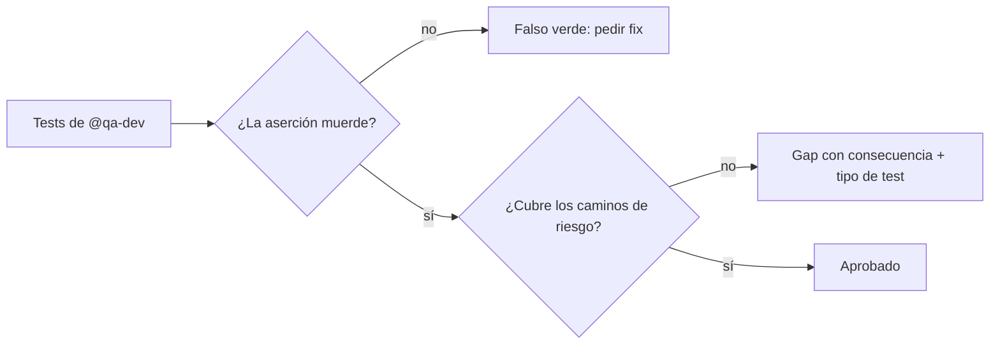

import { Aside } from '@astrojs/starlight/components';

# QA Reviewer

El qa-reviewer revisa la calidad de los tests de `@qa-dev` con una sola vara: **si el comportamiento se rompe, ¿este test se pone en rojo?** Lo que no atrapa errores es costo de mantenimiento, no red de seguridad.

## Qué hace

1. **Mide fuerza de aserciones** — Detecta falsos verdes: truthiness sobre objetos que siempre existen, `assertNotNone`, comparaciones contra sí mismos.
2. **Busca gaps de cobertura** — Qué caminos cambiados quedaron sin test y con qué consecuencia.
3. **Marca tests frágiles** — Los que se rompen en cada refactor por atarse a implementación en vez de comportamiento.
4. **Sugiere mejoras concretas** — Qué aserción, qué caso borde, qué mock falta.

## Cuándo usarlo

| Tarea | Ejemplo |
|---|---|
| Revisar tests | `@qa-reviewer Revisa tests del módulo de pagos` |
| Verificar cobertura | `@qa-reviewer ¿Cubren todos los edge cases?` |
| Calidad | `@qa-reviewer ¿Las assertions son significativas?` |

## Routing

| Tarea | Handler |
|---|---|
| Reescribir los tests marcados | `@qa-dev` |
| Criterio de calidad | Skill `testing-expert` |
| Coordinar el equipo | `@qa-orchestrator` |

## Límites

| ✅ Puede | ❌ No puede |
|---|---|
| Revisar tests y marcar frágiles | Escribir tests (`@qa-dev`) |
| Exigir regresiones por bug | Explorar el codebase (`@finder`) |
| Sugerir mejoras | Diseñar estrategia (`@qa-analyst`) |

<Aside type="tip">
Un suite al 90% de cobertura de líneas con aserciones débiles es ~0% de cobertura real. El reviewer mide errores atrapados, no líneas ejecutadas.
</Aside>
