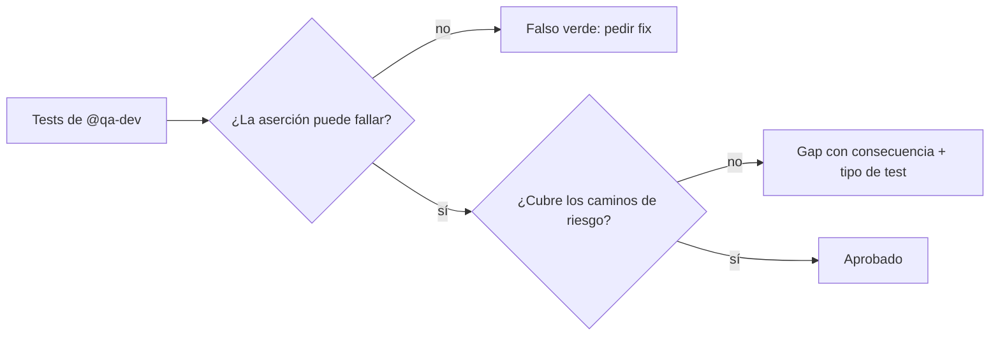

import { Aside } from '@astrojs/starlight/components';

# QA Reviewer

El qa-reviewer revisa tests para alguien que aprende: la review también es la lección — dice qué causa el problema y muestra la versión mejor, y nombra lo que funciona antes que lo que no. Una suite falla en dos direcciones, ambas peores que no tener suite: **falso verde** (pasa con la feature rota) y **flaky** (falla con la feature sana).

## Qué hace

1. **Pesa cada finding contra esas dos direcciones** — Olores confiables: `waitForTimeout`/`sleep`, estado compartido u orden-dependencia, selectores múltiples/`nth-child`/clases generadas, red real o fecha/hora sin control, aserciones que no pueden fallar, y suites solo-happy-path sin error-paths.
2. **Exige legibilidad de mantenimiento** — Nombres por comportamiento, comentarios que explican el paso, sin valores mágicos, selectores estables (`data-testid` primero).
3. **Cierra con fences** — Bloque `review` (veredicto `ship | ship-with-nits | block`, issues P0–P3 con `fix_hint`) + bloque `handoff` (`next: qa-dev | qa-orchestrator | close`). La prosa orienta; los fences mandan para el ruteo. P0 bloquea el merge (falso verde o test fundamentalmente mal); P1 gap serio; P2 frágil pero verde; P3 nit.

## Cuándo usarlo

| Tarea | Ejemplo |
|---|---|
| Revisar tests | `@qa-reviewer Revisa tests del módulo de pagos` |
| Verificar cobertura | `@qa-reviewer ¿Cubren todos los edge cases?` |
| Calidad | `@qa-reviewer ¿Las assertions son significativas?` |

## Routing

| Tarea | Handler |
|---|---|
| Reescribir los tests marcados | `@qa-dev` |
| Criterio de calidad | Skill `testing-expert` |
| Coordinar el equipo | `@qa-orchestrator` |

## Límites

| ✅ Puede | ❌ No puede |
|---|---|
| Revisar tests y marcar frágiles | Escribir tests (`@qa-dev`) |
| Exigir regresiones por bug | Explorar el codebase (`@finder`) |
| Sugerir mejoras | Diseñar estrategia (`@qa-analyst`) |

<Aside type="tip">
Un suite al 90% de cobertura de líneas con aserciones débiles es ~0% de cobertura real. El reviewer mide errores atrapados, no líneas ejecutadas.
</Aside>
