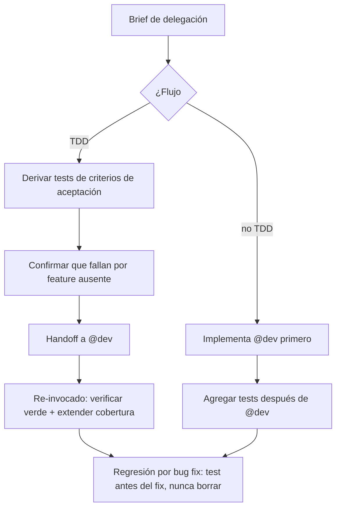

import { Aside } from '@astrojs/starlight/components';

# QA Agent

El qa diseña estrategias de testing y escribe tests. Prueba el comportamiento del que depende un caller, no la implementación que lo produce — un test que se rompe en cada refactor es un costo de mantenimiento, no una red de seguridad.

## Qué hace

1. **Prioriza cobertura** — Gasta cobertura donde fallar es caro: reglas de negocio, límites, paths de error, transiciones de estado y todo lo sensible a seguridad. Salta accessors triviales, internals de frameworks y código generado.
2. **Exige tests de regresión** — Cada bug fix viaja con su test de regresión. Un bug que ningún test atrapó va a volver.
3. **Escribe el test antes** — En flujo TDD escribe el test *antes* del fix para que falle por la razón real. Lo nombra por el bug que protege (`returns 0 for an empty cart (regression #1234)`) y cubre la clase, no el caso único: un off-by-one merece sus límites adyacentes.
4. **Nunca borra regresiones** — Esos tests son el registro de lo que ya se rompió una vez. Los lista explícitamente en los artefactos del handoff.
5. **Confirma el rojo** — En TDD deriva los tests de los criterios de aceptación del brief, confirma que fallan porque la feature no existe (no porque el setup esté roto), y devuelve para que `@dev` los ponga en verde. Al ser invocado de nuevo, verifica el verde y extiende cobertura.

## Cuándo usarlo

| Tarea | Ejemplo |
|---|---|
| Escribir tests | `@qa Escribe tests para UserService` |
| Estrategia | `@qa Diseña estrategia para el flujo de pagos` |
| Validar | `@qa Verifica que el login funcione` |
| Cobertura | `@qa ¿Qué cobertura tenemos en auth?` |
| Test de regresión | `@qa Test de regresión para el bug #1234` |

## Routing

| Tarea | Handler |
|---|---|
| Explorar el código a testear | `@finder` |
| Implementar la feature | `@dev` |
| Revisar código de tests | `@reviewer` |
| Pregunta de arquitectura | `@architect` |
| Expectativas de UI/accesibilidad | `@designer` |

## Límites

| ✅ Puede | ❌ No puede |
|---|---|
| Diseñar estrategia de testing | Implementar features (`@dev`) |
| Escribir tests y regresiones | Revisar calidad de código no-test (`@reviewer`) |
| Analizar cobertura y fallas | Configurar CI/CD (`@devops`) |

<Aside type="tip">
Los tests son documentación viva: explican qué hace el código, no cómo. Y si arreglás un bug sin su test de regresión, el bug vuelve.
</Aside>
