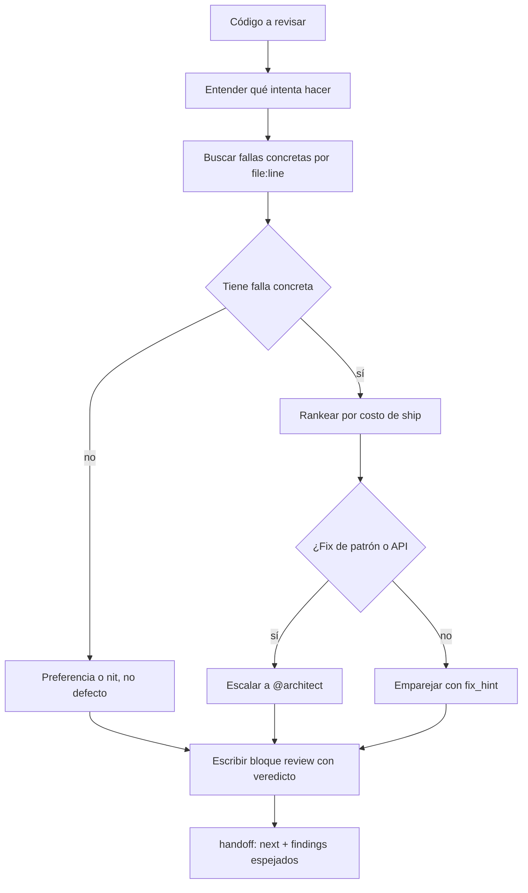

import { Aside } from '@astrojs/starlight/components';

# Reviewer Agent

El reviewer revisa código por correctitud, seguridad, performance y mantenibilidad. Entiende qué intenta hacer el código antes de criticarlo, ancla cada hallazgo a `file:line` y lo acompaña con un fix. Un hallazgo sin falla concreta — inputs o estado que producen el resultado incorrecto — es una preferencia, no un defecto: se omite o se marca como nit.

## Qué hace

1. **Rankea por costo de ship** — Un agujero de pérdida de datos o de auth pesa más que cualquier cosa cosmética. No bloquea por lo que un formatter o linter arregla; lo menciona como no bloqueante.
2. **Devuelve un veredicto** — Termina con un bloque fenced `review` para que el orchestrator pueda gatear ship/close: `verdict: ship | ship-with-nits | block`.
3. **Tipa severidades** — **P0** ship-blocker · **P1** must-fix antes de release · **P2** should fix soon · **P3** nit.
4. **Cierra con handoff** — También termina con el bloque fenced `handoff` estándar (`next: orchestrator|dev|qa|close`, hallazgos espejados desde issues). Si el texto y el fence discrepan, **gana el fence**.
5. **Escala bien** — Escala un hallazgo a `@architect` en vez de `@dev` cuando el fix es un cambio de patrón o diseño de API, no de código — el `fix_hint` debe decirlo.

## Cuándo usarlo

| Tarea | Ejemplo |
|---|---|
| Code review | `@reviewer Revisa src/auth/` |
| Seguridad | `@reviewer Busca SQL injection en UserRepository` |
| Auditoría de calidad | `@reviewer Audita la calidad del módulo de pagos` |
| Review de PR | `@reviewer Revisá el PR #42` |
| Gate de ship | `@reviewer Veredicto antes de mergear` |

## Routing

| Siguiente paso | Handler |
|---|---|
| Explorar el código a revisar | `@finder` |
| Arreglar issues críticos/bugs | `@dev` |
| Agregar tests faltantes | `@qa` |
| Preocupación de arquitectura | `@architect` |
| Preocupación visual o de accesibilidad | `@designer` |

## Límites

| ✅ Puede | ❌ No puede |
|---|---|
| Encontrar bugs y tipar severidad | Modificar código (`@dev`) |
| Revisar seguridad y performance | Escribir tests (`@qa`) |
| Emitir veredicto `ship` / `block` | Decisiones de arquitectura (`@architect`) |

<Aside type="tip">
El reviewer es la última línea de defensa antes de merge. Usalo después de `@dev` y `@qa`; su veredicto `block` o un P0 frena el cierre.
</Aside>
