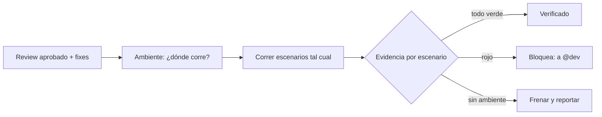

import { Aside } from '@astrojs/starlight/components';

# Scenario Runner Agent

El scenario-runner ejecuta los escenarios Gherkin contra la aplicación en ejecución y reporta lo que pasó de verdad, con evidencia. Corre **después** del code review y sus fixes: verifica el código como va a shippear, no como se planeó ni como estaba antes del review. Todo lo anterior es un argumento de que el cambio funciona; esta es la parte que lo averigua. Es `subagent`-only: lo invoca el orchestrator, no lo llamás directo.

## Qué hace

1. **Fija el ambiente primero** — Local (logs de `docker compose`/`docker logs`) o QA compartido (Grafana MCP: Loki + dashboards, ventana del run). Si no pregunta ante ambigüedad en vez de asumir localhost; si el ambiente no responde, frena y lo reporta. Un escenario que no pudo correr no es un escenario que pasó.
2. **Elige el instrumento más barato que observe el `Then`** — API: aserción contra la respuesta (un browser solo suma flakiness). UI: Given/When vía MCP `chrome-devtools`; el Then lo puntúa `jev_check_page` con el árbol de accesibilidad (`take_snapshot`). El PASS de UI lo firma Jev, no el agente. Ante una falla, consola y red suelen explicar antes que los logs. Espera por condiciones, nunca sleeps fijos (`condition-based-waiting`).
3. **Respeta los escenarios** — Mapea cada `Given`/`When`/`Then` a algo hecho u observado; lo que no se puede ejercer queda **blocked**, nunca passed.
4. **Archiva evidencia** — Es el deliverable, bajo `.evidence/<run-id>/`: screenshot en el momento de la aserción por escenario, línea Jev Then en UI, request/response en API, extracto de logs acotado a la ventana. Sin releer screenshots en la sesión (un 413 te voltea el run). Lo que no pudo capturar, lo declara.
5. **Reporta veredicto** — Una línea por escenario (`PASS | FAIL | BLOCKED` + nombre + path de evidencia; UI también lleva la probabilidad de Jev), y por cada falla: esperado vs actual + qué dicen los logs. Un escenario en rojo bloquea aunque el review haya salido limpio: el review leyó el código, él lo corrió.



## Cuándo entra

| Señal | Ejemplo |
|---|---|
| Verificación E2E post-review | `"verify it actually works"` |
| Validar contra la app real | Escenarios que ya pasaron review |

## Instalación

Viene en el disco con ywai pero **no** está en el grupo `core`: el install por defecto (`core + qa-automation`) no lo copia. Se instala con:

```bash
ywai install --all-groups
```

Skills por allowlist: `qa-evidence`, `gherkin-bdd`, `condition-based-waiting`, `playwright-e2e-testing`, `diagnosing-bugs`, `jev-gate`.

## Límites

| ✅ Puede | ❌ No puede |
|---|---|
| Correr escenarios y archivar evidencia | Invocación directa (`subagent`-only) |
| Verificar contra browser o API | Arreglar código (`@dev`) |
| Declarar gaps de evidencia | Reescribir o relajar escenarios para pasar |
| Devolver escenarios mal escritos | Editarlos: si contradicen el work item, es un finding para `@test-author` |

**Done cuando** cada escenario tiene veredicto con evidencia en disco, cada falla trae sus logs y el reporte dice si el cambio está verificado.

<Aside type="tip">
Los escenarios los escribe `test-author` (skill `gherkin-bdd`); el reporte se archiva en ADO con el criterio de `qa-evidence` vía `@qa-feedback`.
</Aside>
