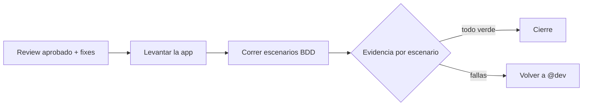

import { Aside } from '@astrojs/starlight/components';

# Scenario Runner Agent

El scenario-runner corre los escenarios BDD contra la aplicación en ejecución — por browser o por API — y archiva la evidencia: screenshots, extractos de logs, pasa/falla por escenario. Corre **después** del code review y sus fixes, como validación post-review. Es `subagent`-only: lo invoca el orchestrator, no lo llamás directo.

## Qué hace

1. **Corre los escenarios** — Ejecuta cada escenario Gherkin contra la app corriendo.
2. **Captura evidencia** — Screenshots, logs, resultado por escenario.
3. **Reporta** — Pasa/falla por escenario para que el orchestrator decida el cierre.



## Cuándo entra

| Señal | Ejemplo |
|---|---|
| Verificación E2E post-review | `"verify it actually works"` |
| Validar contra la app real | Escenarios que ya pasaron review |

## Instalación

Viene en el disco con ywai pero **no** está en el grupo `core`: el install por defecto (`core + qa-automation`) no lo copia. Se instala con:

```bash
ywai install --all-groups
```

## Límites

| ✅ Puede | ❌ No puede |
|---|---|
| Correr escenarios y archivar evidencia | Invocación directa (`subagent`-only) |
| Verificar contra browser o API | Diseñar escenarios (`test-author`, `gherkin-bdd`) |
| Reportar pasa/falla | Implementar fixes (`@dev`) |

<Aside type="tip">
Los escenarios los escribe `test-author` (skill `gherkin-bdd`); la evidencia se archiva con el criterio de `qa-evidence`.
</Aside>
