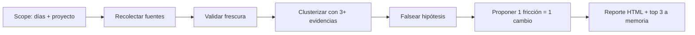

import { Aside, Card, Steps } from '@astrojs/starlight/components';

# Retro de workflow

## Qué es

Una retro sobre tu workflow con dev-AI que responde una sola pregunta: **qué fricción se repitió y qué cambio único la elimina**. La ejecuta un agente con la skill `workflow-retro`, con datos de sesiones, evals, memoria y git — no con sensaciones.



## Cómo usarla

<Steps>

1. Definí el scope: días y proyecto o worktree. Sin scope no hay retro.
   ```
   /workflow-retro últimos 7 días
   ```

2. El agente recolecta todo antes de concluir: `ywai eval run --json`, scores de evals por API, recall de Engram y `git log`. Una fuente caída no frena la corrida.

3. Abrí el reporte HTML que te devuelve (vive en el temp dir del OS, con botones para PDF y PNG). Nada queda en el repo.

4. Aplicá el experimento ganador: cada finding trae **una** palanca (`skill|agent|tool|code`) y su métrica de éxito.

5. Los 3 findings top se guardan solos en memoria como `pattern` para la próxima.

</Steps>

## Scopes

| Lo que escribís | Qué entiende |
|---|---|
| `/workflow-retro` | Últimos 7 días, todo |
| `/workflow-retro últimos 7 días` | `days=7` |
| `/workflow-retro --days 30` | `days=30` |
| `/workflow-retro proyecto X` | Filtra por proyecto X |
| `/workflow-retro dev-ai-workflow` | Filtra por worktree que matchee |

## Cómo leer un finding

```
Fricción:   re-trabajo en tests e2e (4 sesiones, 2 proyectos)
Hipótesis:  los selectors acoplados al DOM rompen cada cambio visual
Refutación: buscar fallas sin cambio visual previo → 0 casos, sobrevive
Palanca:    skill (condition-based-waiting + data-testid)
Experimento: migrar 1 suite y medir flakiness 7 días
Éxito:      0 fallas verdes-falsas en la ventana
```

Sin las 3+ evidencias no es un finding: es una anécdota y se descarta.

## Reglas duras

| Regla | Por qué |
|---|---|
| Una fricción = un cambio | Dos cambios en un experimento no enseñan nada |
| Falsificar antes de proponer | Evita findings decorativos |
| Tracker ciego = finding #1 | Si los datos están rancios, eso es lo primero a arreglar |
| Menos findings Strong > lista padded | Prioriza lo que duele y se puede arreglar |

## Cuándo correrla

| Situación | Scope |
|---|---|
| Uso habitual, ventana corta | `/workflow-retro` |
| Un proyecto puntual | `/workflow-retro proyecto X` |
| Ventana larga, tendencias | `/workflow-retro --days 30` |

<Card title="¿De dónde sale el command?" icon="puzzle">
  `/workflow-retro` lo instala la skill `workflow-retro` en cada agente (ver [referencia](/dev-ai-workflow/skills/reference#workflow-retro)). Los datos crudos viven en [Evals](/dev-ai-workflow/evals) y [Memories](/dev-ai-workflow/memories).
</Card>

<Aside type="tip">
Corré la retro, aplicá UN experimento, y en la siguiente medí su métrica de éxito. La retro que no cambia nada es un ritual.
</Aside>
