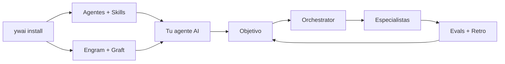

import { Badge, Card, CardGrid } from '@astrojs/starlight/components';

<Badge text="26 agentes" variant="tip" /> <Badge text="29 skills" variant="tip" /> <Badge text="5 workflows" variant="tip" /> <Badge text="OpenCode 2" variant="note" />

## Cómo encaja



## Qué hace ywai

Configura tu agente AI (opencode, Claude Code, Cursor, etc.) con **agentes especializados** y **skills** que saben cómo usar tu stack tecnológico.

```
ywai install → agentes + skills + Engram + Graft → listo para usar
```

## Quick path

```bash
# 1. Instalar
curl -fsSL https://github.com/Yoizen/dev-ai-workflow/releases/latest/download/install.sh | bash

# 2. Configurar
ywai install

# 3. Verificar
ywai doctor

# 4. Usar
@dev Implementa el endpoint de login
```

## Elegí tu camino

| Si querés… | Usá | Ver |
|---|---|---|
| Escribir código o arreglar un bug | `@dev` | [Dev →](/dev-ai-workflow/agents/dev) |
| Planificar antes de picar | `@planning` o `/planning` | [Planning →](/dev-ai-workflow/agents/planning) |
| Entregar una feature completa | `/ship` | [Commands →](/dev-ai-workflow/workflows/commands) |
| Testear con estrategia | `/qa-automation` | [QA Automation →](/dev-ai-workflow/agents/qa-orchestrator) |
| Infra, pipelines, deploys | `@devops` o ambiente `devops` | [DevOps →](/dev-ai-workflow/agents/devops) |
| Responder una pregunta del repo | `@ask` + `@finder` | [Ask →](/dev-ai-workflow/agents/ask) |
| Detectar fricción repetida | `/workflow-retro` | [Retro →](/dev-ai-workflow/guides/retro) |

## Qué obtenés

<CardGrid stagger>
  <Card title="26 perfiles de agente" icon="users">
    12 core + QA Automation (5) + QA Exploratory (5) + subagentes y experimentales. Cada uno con trigger, routing y límites.

    [Ver agentes →](/dev-ai-workflow/agents)
  </Card>
  <Card title="29 skills extra" icon="puzzle">
    Angular, yz-ui, TDD, Playwright, ADO, Docker, grilling, ADRs y más, sobre el catálogo base de gentle-ai.

    [Ver skills →](/dev-ai-workflow/skills)
  </Card>
  <Card title="5 workflows semilla" icon="rocket">
    `/ship`, `/planning`, `/qa-automation`, `/qa-exploratory` y `/scenario-verification`, más Studio visual para los tuyos.

    [Ver workflows →](/dev-ai-workflow/workflows)
  </Card>
  <Card title="Ambientes aislados" icon="laptop">
    `dev`, `qa`, `devops`, `code-review` y más: cada uno con su config, DB y modelo. Lo global no se toca.

    [Ver environments →](/dev-ai-workflow/environments)
  </Card>
  <Card title="Evals con datos reales" icon="chart">
    Session Analytics sobre tus sesiones y benchmarks por modelo con compuertas para CI.

    [Ver evals →](/dev-ai-workflow/evals)
  </Card>
  <Card title="25 comandos CLI" icon="terminal">
    `install`, `update`, `doctor`, `env`, `eval`, `mcp`, `session`, `advisor`, `tokenbank` y el panel web.

    [Ver comandos →](/dev-ai-workflow/cli)
  </Card>
</CardGrid>

## Antes vs Después

| Sin ywai | Con ywai |
|---|---|
| Agente genérico para todo | Especialistas por tarea |
| Configurar skills manualmente | `ywai install` y todo queda listo |
| Buscar skills para cada framework | Decenas de skills preinstaladas |
| Mantener configuraciones por separado | Un solo comando para actualizar todo |

## Siguiente paso

<CardGrid stagger>
  <Card title="Primeros pasos" icon="star">
    Instalación, primera tarea, y conceptos clave.

    [Empezar →](/dev-ai-workflow/getting-started)
  </Card>
  <Card title="Guías prácticas" icon="pencil">
    Features, bugs, reviews, testing, CI/CD y retro de workflow.

    [Ver guías →](/dev-ai-workflow/guides)
  </Card>
</CardGrid>
