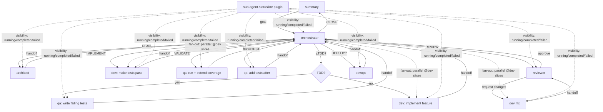

# ywai Agents

Pre-configured agent profiles for different roles. Each agent has a focused system prompt and tool configuration.

## Available Agents

| Agent | Role | Best For |
|-------|------|----------|
| `orchestrator` | Technical Lead | Multi-step goals: plan → test/implement → review → ship via delegation |
| `ask` | Research & Q&A | Quick questions, explanations, research, analysis |
| `finder` | Codebase Explorer | Search, navigate, and explore files and code (read-only) |
| `dev` | Developer | Implementation, coding, debugging, refactoring |
| `qa` | QA Engineer | Testing, test strategy, quality assurance |
| `architect` | Architect | Design decisions, patterns, system design |
| `reviewer` | Code Reviewer | PR reviews, code quality, security audits |
| `devops` | DevOps Engineer | CI/CD, deployments, infrastructure, monitoring |

## Delegation Flow

The `orchestrator` is a `primary` agent that owns a goal and delegates to the
specialist subagents, collecting a standard **handoff** from each before deciding
the next step.



**Key points:**
- The orchestrator owns the goal and decides the next step from each handoff.
- TDD branch: `@qa` writes failing tests → `@dev` makes them pass → `@qa` validates.
- Fan-out: the orchestrator can spawn multiple `@dev` (or `@qa`) in parallel for disjoint workstreams.
- Each subagent ends with a `## Handoff (report back to @orchestrator)` block.
- The `sub-agent-statusline` plugin (installed automatically with `ywai install`) gives real-time visibility into running/completed/failed subagents, elapsed time, and token/context usage.

The orchestrator uses a **capability model** with per-platform adapters. On opencode
it delegates via `task` (sync) and `delegate` (async), asks decisions with `question`,
and tracks plans with `todowrite`. On Claude Code it uses `Agent`/`Task` and
`TaskCreate`/`Update`. On PI.dev it uses subagent tools. All hosts fall back to
`@mention` routing when the native tool is unavailable.

## Config Format

Each agent directory contains:

```
agents/
├── ask/
│   ├── AGENT.md        # System prompt (required)
│   ├── permissions.json # Tool permissions (optional)
│   └── skills.txt      # Linked skills (optional)
├── dev/
│   └── ...
```

### AGENT.md

The main system prompt. Uses the same SKILL.md frontmatter format:

```yaml
---
name: dev
description: Implementation-focused developer agent
role: developer
mode: all
---
```

### permissions.json (optional)

Configure which tools the agent can use. Valid values are `allow`, `ask`, or `deny`:

```json
{
  "read": "allow",
  "edit": "allow",
  "write": "allow",
  "bash": "allow",
  "glob": "allow",
  "grep": "allow"
}
```

### skills.txt (optional)

Skills to link when this agent is active (one per line):

```
typescript
react-19
tailwind-4
```

## Usage with ywai

```bash
# Install with a specific agent profile
ywai install --agent opencode --profile dev

# Or use the agent prompt directly
cat ywai/agents/dev/AGENT.md
```

## Platform Compatibility

| Platform | Path | Frontmatter Shape | Status |
|---|---|---|---|
| OpenCode | `~/.config/opencode/agents/*.md` | `description`, `mode`, `permission:` block | ✅ Full support |
| Claude Code | `~/.claude/agents/*.md` | `name`, `description`, `tools:` (PascalCase) | ✅ Full support |
| PI.dev | `~/.pi/agent/agents/*.md` | `name`, `description`, `tools:` (lowercase) | ✅ Full support |
| Cursor | `~/.cursor/agents/*.md` | (same as Claude) | ✅ Full support |
| VS Code Copilot | `~/.config/Code/User/prompts/*.instructions.md` | `name`, `description`, `applyTo` | ✅ Full support |

## Philosophy

- **Focused**: Each agent has a clear, narrow role
- **Opinionated**: Strong defaults that work out of the box
- **Composable**: Agents can reference skills for domain-specific knowledge
- **Portable**: Works across opencode, claude-code, cursor, windsurf, PI.dev, etc.
