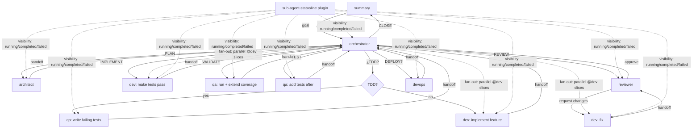

# ywai Agents

Pre-configured agent profiles for different roles. Each agent has a focused system prompt and tool configuration.

## Available Agents

| Agent | Role | Best For |
|-------|------|----------|
| `orchestrator` | Technical Lead | Goals: **solo** (act alone), **thin** (0–1 hop), or **full** multi-agent delivery |
| `ask` | Research & Q&A | Primary for questions, explanations, analysis (read-only) |
| `finder` | Codebase Explorer | Only scout: locate code, delivery scout, QA scout (read-only) |
| `dev` | Developer | Implementation, coding, debugging, refactoring |
| `qa` | QA Engineer | Testing, test strategy, quality assurance |
| `architect` | Architect | Design decisions, patterns, system design |
| `reviewer` | Code Reviewer | PR reviews, code quality, security audits |
| `devops` | DevOps Engineer | CI/CD, deployments, infrastructure, monitoring |
| `memory` | Memory Specialist | Memory consolidation, deduplication, structured plans |
| `planning` | Planning | Plan mode: research → clarify → draft plan → approval gate (read-only until approved) |

**One scout:** use `@finder` for all exploration (including QA). There is no separate `qa-finder`.  
**Models:** `fast` / `balanced` / `deep` profiles set per-agent models (Settings → Profiles in the web UI).  
**Install default groups:** `core` + `qa-automation`. TokenBank + active model profile are applied on install when credentials exist.

## Execution modes (`orchestrator`)

| Mode | When | Behavior |
|------|------|----------|
| `solo` | One file / clear small fix / Q&A | Orchestrator acts alone (search + edit + verify). Zero subagents. |
| `thin` | Clear "do X", limited scope | Prefer act alone; at most one sync `delegate` hop. |
| `full` | Multi-phase, ordered deps, ship | Classic SCOUT → PLAN → implement/test → review. No product edits by orchestrator. |

- **Risk** (auth, migrations, public API, …) decides TDD/review — not mode size alone.
- Unsure → **thin**, never full.
- See `docs/design/orchestrator-execution-modes.md`.

## Delegation Flow

In **full** mode the orchestrator owns the goal and delegates to specialists,
collecting a standard **handoff** from each before deciding the next step.
In **solo** / **thin** it may implement directly.


```mermaid
graph TD
    U[User] -->|goal| O[orchestrator]

    O -->|PLAN| A[architect]
    A -->|handoff| O

    O -->|¿TDD?| Q{TDD?}
    Q -->|yes| QA1[qa: write failing tests]
    QA1 -->|handoff| O
    O -->|IMPLEMENT| D1[dev: make tests pass]
    D1 -->|handoff| O
    O -->|VALIDATE| QA2[qa: run + extend coverage]
    QA2 -->|handoff| O

    Q -->|no| D2[dev: implement feature]
    D2 -->|handoff| O
    O -->|TEST| QA3[qa: add tests after]
    QA3 -->|handoff| O

    O -->|REVIEW| R[reviewer]
    R -->|approve| O
    R -->|request changes| D3[dev: fix]
    D3 -->|handoff| R

    O -->|DEPLOY?| DO[devops]
    DO -->|handoff| O

    O -->|CLOSE| U[summary]

    %% Fan-out annotation
    O -.->|fan-out: parallel @dev slices| D1
    O -.->|fan-out: parallel @dev slices| D2
    O -.->|fan-out: parallel @dev slices| D3

    %% Statusline plugin
    SL[sub-agent-statusline plugin]
    SL -.->|visibility: running/completed/failed| O
    SL -.->|visibility: running/completed/failed| A
    SL -.->|visibility: running/completed/failed| D1
    SL -.->|visibility: running/completed/failed| D2
    SL -.->|visibility: running/completed/failed| D3
    SL -.->|visibility: running/completed/failed| QA1
    SL -.->|visibility: running/completed/failed| QA2
    SL -.->|visibility: running/completed/failed| QA3
    SL -.->|visibility: running/completed/failed| R
    SL -.->|visibility: running/completed/failed| DO
```

**Key points:**
- Mode first: solo/thin skip the mermaid pipeline; full uses it.
- TDD/review follow **risk policy** (and user/project strict TDD), not file count.
- Fan-out: multiple `@dev` only for disjoint workstreams.
- Subagents end with a compact JSON `handoff` fence (`verified` after write/test work).
- **`@dev`:** no `git commit`/`push` (OpenCode). In **solo**, orchestrator may local-commit; no push unless the user asks.
- In **full**, orchestrator does not edit product code — writes go through subagents.
- The `sub-agent-statusline` plugin gives visibility into running/completed/failed subagents.

The orchestrator uses a **capability model** with per-platform adapters. On OpenCode
v2 it delegates via `delegate` (returns an ID immediately) and supervises
with `delegation_*`. There is no `mode` argument; wait for `<task-notification>` then `delegation_read` when the next step needs the result. `delegate` is the runtime delegation tool
(permission action `subagent` still gates who may be launched). It asks decisions
with `question` and tracks plans with `todowrite`. On Claude Code it uses
`Agent`/`Task` and `TaskCreate`/`Update`. On PI.dev it uses host subagent tools.
All hosts fall back to `@mention` routing when the native tool is unavailable.

## Config Format

Each agent directory contains:

```
agents/
├── ask/
│   ├── AGENT.md        # System prompt (required)
│   ├── permissions.json # Tool permissions (optional)
│   └── skills.txt      # Linked skills (optional)
├── dev/
│   └── ...
├── sections/
│   ├── handoff.md          # Standard handoff format (core subagents → @orchestrator)
│   ├── handoff-qa.md       # Handoff format for qa-automation subagents (@qa-*)
│   ├── context-gathering.md # Context gathering protocol
│   ├── orchestrator-contracts.md      # Short pointer (auto-appended to orchestrators)
│   └── orchestrator-contracts-full.md # Full handoff/review schema (read on demand / workflow export)
```

Shared sections are appended to an agent's prompt at build time when referenced in the `sections:` frontmatter array (e.g. `sections: [handoff, context-gathering, tdd]`). A section named `foo` resolves to `sections/foo.md`; missing sections are skipped silently.

### AGENT.md

The main system prompt. Uses the same SKILL.md frontmatter format:

```yaml
---
name: dev
description: Implementation-focused developer agent
role: developer
mode: all
---
```

### permissions.json (optional)

Configure which tools the agent can use. Valid values are `allow`, `ask`, or `deny`.
Keys follow a canonical order for consistency:

```json
{
  "read": "allow",
  "edit": "allow",
  "write": "allow",
  "bash": "allow",
  "glob": "allow",
  "grep": "allow",
  "lsp": "allow",
  "ast_grep": "allow",
  "websearch": "allow",
  "webfetch": "allow",
  "code_search": "allow",
  "task": "allow",
  "delegate": "allow",
  "question": "allow",
  "skill": "allow",
  "memory": "allow",
  "intercom": "allow",
  "mcp": "allow"
}
```

### skills.txt (optional)

Skills to link when this agent is active (one per line):

```
typescript
react-19
tailwind-4
```

## Usage with ywai

```bash
# Install with a specific agent profile
ywai install --agent opencode --profile dev

# Or use the agent prompt directly
cat ywai/agents/dev/AGENT.md
```

## Platform Compatibility

| Platform | Path | Frontmatter Shape | Status |
|---|---|---|---|
| OpenCode | `~/.config/opencode/agents/*.md` | `description`, `mode`, `permission:` block | ✅ Full support |
| Claude Code | `~/.claude/agents/*.md` | `name`, `description`, `tools:` (PascalCase) | ✅ Full support |
| PI.dev | `~/.pi/agent/agents/*.md` | `name`, `description`, `tools:` (lowercase) | ✅ Full support |
| OMP (oh-my-pi) | `~/.omp/agent/agents/*.md` | `name`, `description`, `tools:` (lowercase) — **core group only** | ✅ Core agents |
| Cursor | `~/.cursor/agents/*.md` | (same as Claude) | ✅ Full support |
| VS Code Copilot | `~/.config/Code/User/prompts/*.instructions.md` | `name`, `description`, `applyTo` | ✅ Full support |

TokenBank models for OMP: `ywai tokenbank configure --agent omp` → `~/.omp/agent/models.yml`.

## Philosophy

- **Focused**: Each agent has a clear, narrow role
- **Opinionated**: Strong defaults that work out of the box
- **Composable**: Agents can reference skills for domain-specific knowledge
- **Portable**: Works across opencode, claude-code, cursor, windsurf, PI.dev, etc.
