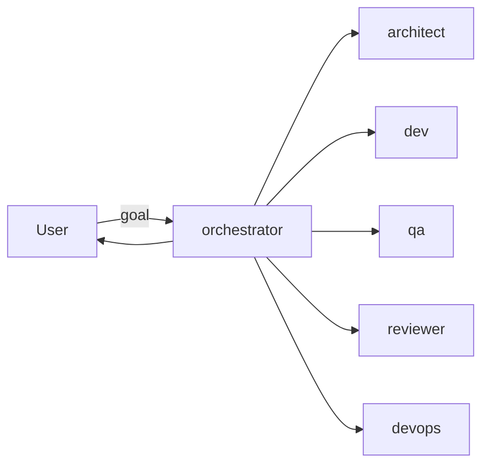
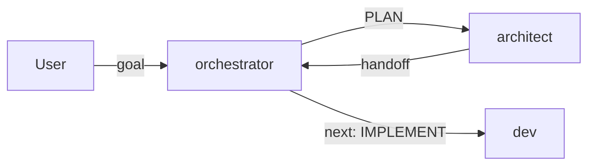
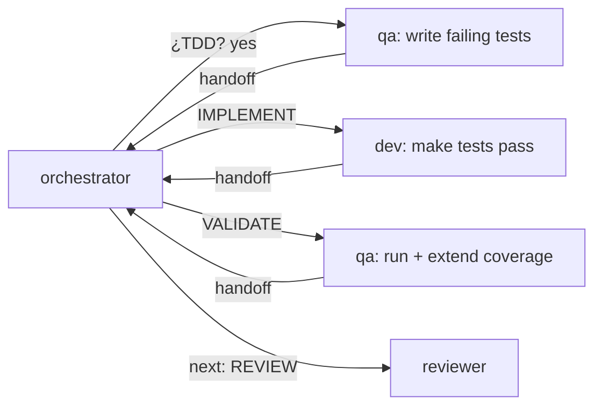
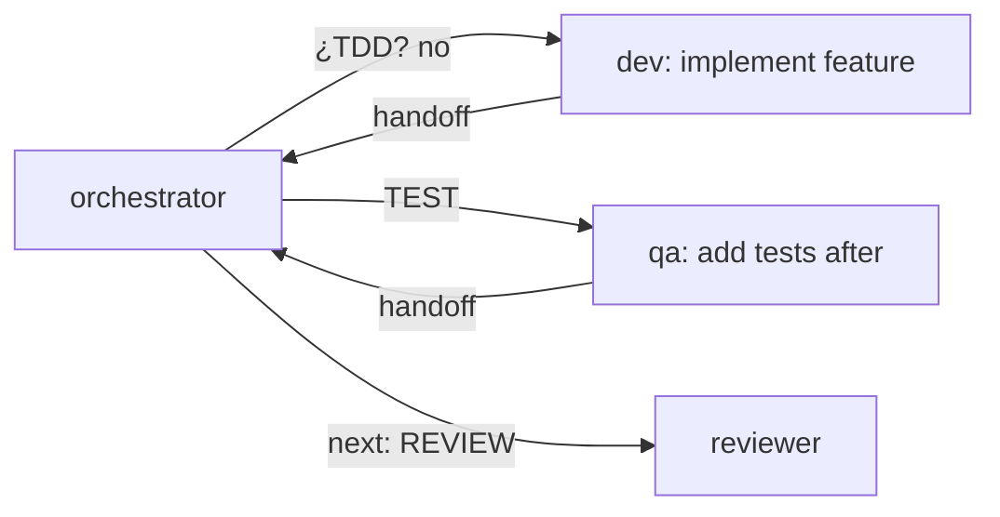
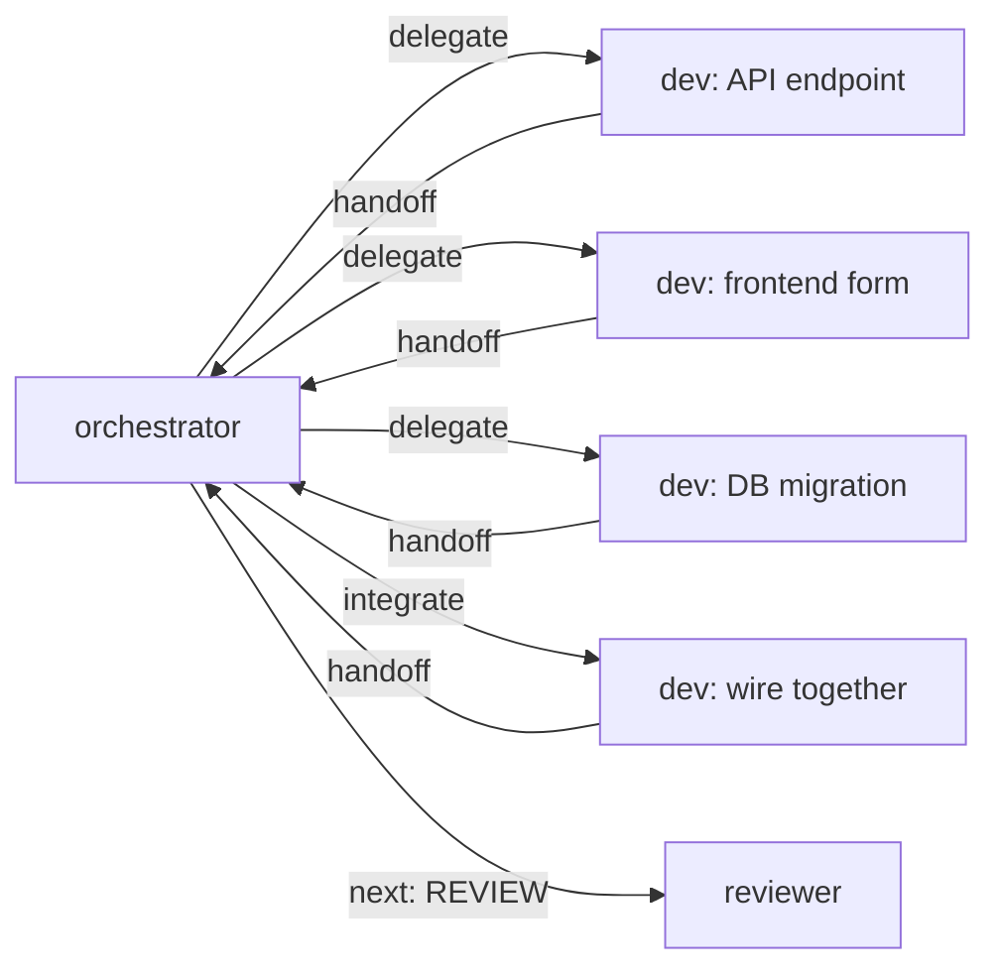
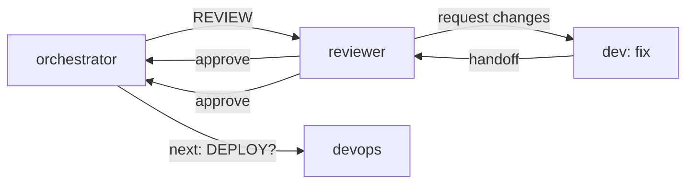
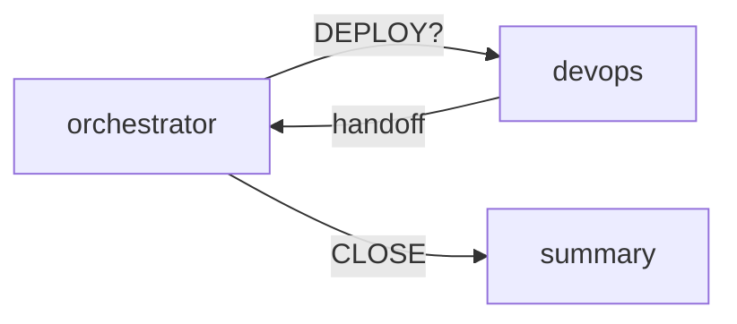
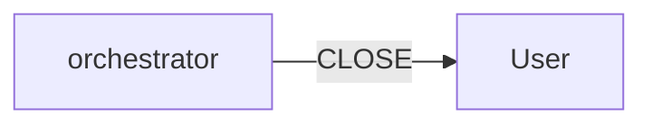
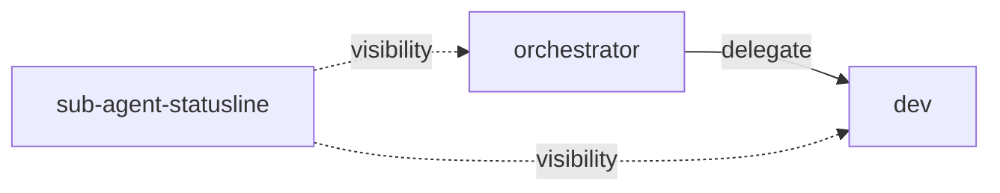

# ywai Agents Workflow

Visual guide to how the orchestrator delegates work across the specialist subagents.

## Overview

The `orchestrator` is the technical lead. It owns the goal, delegates to specialists, collects handoffs, and decides the next step.



## 1. Planning Phase

The orchestrator delegates design/planning to the architect, which produces a **Product plan** (what/why) and a **Technical plan** (how).



**Architect handoff includes:**
- Product plan: problem, goal, scope, user stories, acceptance criteria
- Technical plan: approach, components, work breakdown, test strategy, rollout

## 2. TDD Branch

The orchestrator asks the user whether to use TDD. This branches the flow.

### TDD = yes (tests first)



### TDD = no (tests after)



## 3. Fan-out: Parallel Delegation

When work splits into independent streams (e.g. API + frontend + DB migration), the orchestrator can spawn multiple `@dev` in parallel.



**Guardrails:**
- Never run parallel delegations that write the same files.
- Assign disjoint scopes in each brief's `Constraints`.
- Join handoffs, resolve conflicts, then integrate.

## 4. Review Cycle

The reviewer approves or requests changes. If changes are requested, the cycle repeats.



## 5. Deploy (optional)

For features that need CI/CD, containers, or deployment, the orchestrator delegates to devops.



## 6. Close

The orchestrator summarizes delivered work, artifacts, and follow-ups.



## Handoff Format

Every subagent ends with a standard handoff:

```
**Status**: done | blocked | needs-decision
**Did**: <summary>
**Artifacts**: <files / tests / ADR / etc>
**Next suggested**: @dev | @qa | @reviewer | @devops | close
**Notes/risks**: <...>
```

## Sub-agent-statusline Plugin

The `sub-agent-statusline` plugin (installed automatically with `ywai install`) gives real-time visibility into running/completed/failed subagents, elapsed time, and token/context usage.



**Key features:**
- Sidebar shows running/completed/failed subagents
- Footer summary when there's activity
- Keyboard navigation: Alt+B to focus sidebar
